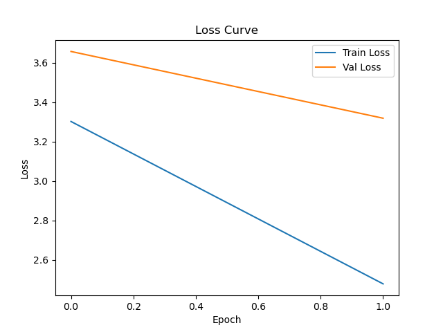
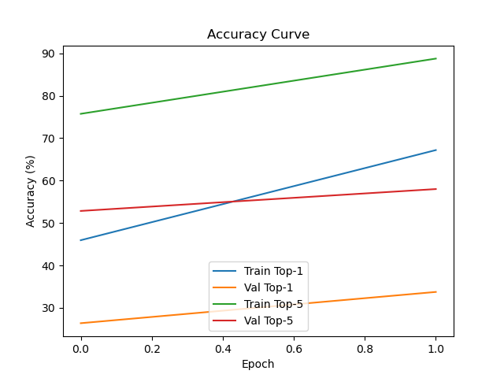
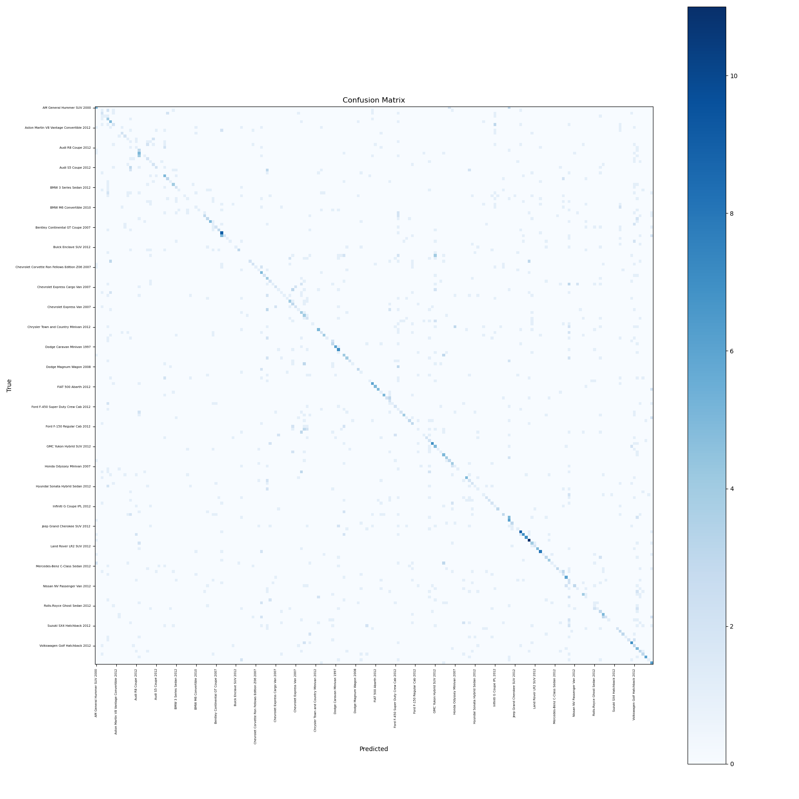
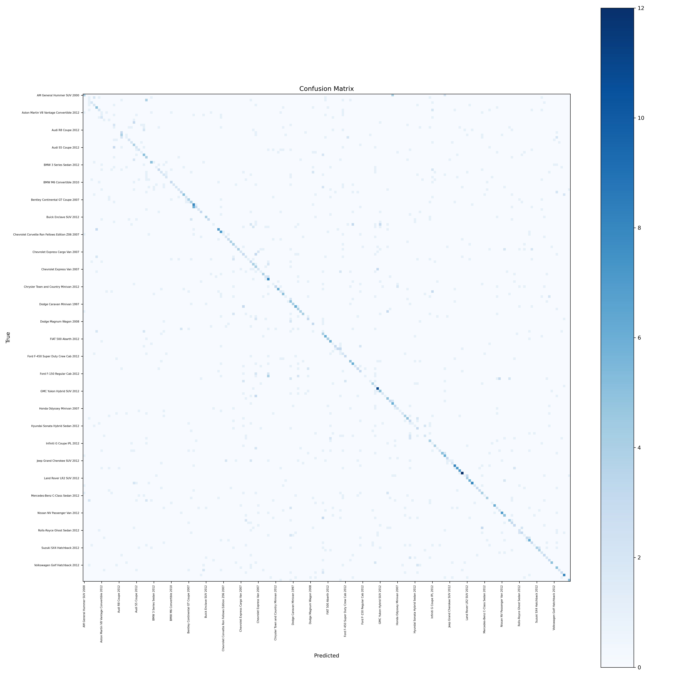
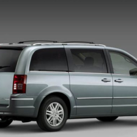

# Experiment Log

## Experiment: multihead_v3_regularization
**Date:** 2025-11-13 14:49:54

**Changes Made:**
- Added L2 regularization (weight_decay=0.01)
- Switched batch size 64 → 128

**Reason for Change:**
Testing stronger regularization to improve generalization

**Training Metrics:**
- Epoch 1: Accuracy=0.7954, Loss=0.5501
- Epoch 2: Accuracy=0.7489, Loss=0.4815
- Epoch 3: Accuracy=0.8103, Loss=0.2136
- Epoch 4: Accuracy=0.7530, Loss=0.5166
- Epoch 5: Accuracy=0.7101, Loss=0.4452

**Final Results:**
Accuracy=0.7101, Loss=0.4452

**Notes / Insights:**
Even with errors, accuracy was promising. Need to test smaller LR.

---

## Experiment: multihead_v3_regularization
**Date:** 2025-11-13 14:53:50

**Changes Made:**
- Added L2 regularization (weight_decay=0.01)
- Switched batch size 64 → 128

**Reason for Change:**
Testing stronger regularization to improve generalization

**Training Metrics:**
- Epoch 1: Accuracy=0.8824, Loss=0.5900
- Epoch 2: Accuracy=0.8164, Loss=0.3107
- Epoch 3: Accuracy=0.8179, Loss=0.4040
- Epoch 4: Accuracy=0.9041, Loss=0.4281
- Epoch 5: Accuracy=0.8264, Loss=0.2190

**Final Results:**
Accuracy=0.8264, Loss=0.2190

**Notes / Insights:**
Hello world

---

## Experiment: multihead_v4_dropout_experiment
**Date:** 2025-11-13 14:59:37

**Changes Made:**
- Added Dropout 0.3
- Changed optimizer to AdamW

**Reason for Change:**
Try to reduce overfitting

**Training Metrics:**
- Epoch 1: Accuracy=0.8500, Loss=0.4000
- Epoch 2: Accuracy=0.9000, Loss=0.3000
- Epoch 3: Accuracy=0.9500, Loss=0.2000

**Final Results:**
Accuracy=0.95, Loss=0.25

**Notes / Insights:**
Promising results, model stable.

---

## Experiment: multihead_v4_dropout_experiment
**Date:** 2025-11-13 15:01:06

**Changes Made:**
- Added Dropout 0.3
- Changed optimizer to AdamW

**Reason for Change:**
Try to reduce overfitting

**Training Metrics:**
- Epoch 1: Accuracy=0.8500, Loss=0.4000
- Epoch 2: Accuracy=0.9000, Loss=0.3000
- Epoch 3: Accuracy=0.9500, Loss=0.2000

**Final Results:**
Accuracy=0.95, Loss=0.25

**Notes / Insights:**
Promising results, model stable.

---

## Experiment: multihead_v4_dropout_experiment
**Date:** 2025-11-13 15:03:27

**Changes Made:**
- Added Dropout 0.3
- Changed optimizer to AdamW

**Reason for Change:**
Try to reduce overfitting

**Training Metrics:**
- Epoch 1: Accuracy=0.8500, Loss=0.4000
- Epoch 2: Accuracy=0.9000, Loss=0.3000
- Epoch 3: Accuracy=0.9500, Loss=0.2000

**Final Results:**
Accuracy=0.95, Loss=0.25

**Notes / Insights:**
Promising results, model stable.

---

## Experiment: multihead_v6_dropout_lr
**Date:** 2025-11-13 15:47:26

**Changes Made:**
- Added dropout 0.3
- Adjusted learning rate schedule

**Reason for Change:**
Improve generalization and convergence speed

**Training Metrics:**
- Epoch 1: Accuracy=0.1657, Loss=4.2302

**Final Results:**
Best validation Accuracy=0.1657

**Notes / Insights:**
Training finished in 9m 38s

---

## Experiment: Name of experiment
**Date:** 2025-11-13 16:15:10

**Changes Made:**
Changes

**Reason for Change:**
Improve generalization and convergence speed

**Training Metrics:**
- Epoch 1: Accuracy=0.1799, Loss=4.2166
- Epoch 2: Accuracy=0.2523, Loss=3.7143

**Final Results:**
Best validation Accuracy=0.2523

**Notes / Insights:**
Training finished in 19m 18s

---

## Experiment: Name of experiment
**Date:** 2025-11-21 13:12:23

### Changes
Changes

### Reason
Improve generalization and convergence speed

### Metrics
- Epoch 1: train_loss=4.753735759380865, train_acc=0.08856485034535687, val_loss=4.1976856248667085, val_acc=0.1921424186617557
- Epoch 2: train_loss=3.3121923457633873, train_acc=0.4603223330775134, val_loss=3.665686407873717, val_acc=0.2713321055862492

### Results
Best Validation Accuracy = 0.2713

### Notes
Training completed successfully. Loss/accuracy plots and confusion matrix logged.

### Images / Plots

---

## Experiment: Name of experiment
**Date:** 2025-11-23 11:11:25

### Changes
Changes

### Reason
Improve generalization and convergence speed

### Metrics
- Epoch 1: train_loss=4.748616948058215, train_top1=9.286262472976837, train_top5=22.762854948358545, val_loss=4.185996989372539, val_top1=17.86372006429786, val_top5=42.418661736944394
- Epoch 2: train_loss=3.310763511452781, train_top1=46.83039140328022, train_top5=74.99616270497133, val_loss=3.6636675466709594, val_top1=25.966850831071024, val_top5=51.810926965440686

### Top-1 Accuracy per Epoch
[9.286262472976837, 17.86372006429786, 46.83039140328022, 25.966850831071024]

### Top-5 Accuracy per Epoch
[22.762854948358545, 42.418661736944394, 74.99616270497133, 51.810926965440686]

### Results
Best Top-1 Accuracy = 25.97%

### Notes
Training finished. Logged curves, confusion matrix, sample image.

### Images / Plots

---

## Experiment: Name of experiment
**Date:** 2025-11-23 12:42:05

### Changes
Changes

### Reason
Improve generalization and convergence speed

### Metrics
- Epoch 1: train_loss=3.3020107080455205, train_top1=45.95548733574376, train_top5=75.74827321916933, val_loss=3.6568006718356307, val_top1=26.39656231050626, val_top5=52.854511975217555
- Epoch 2: train_loss=2.479187075833769, train_top1=67.19877206271003, train_top5=88.7643898753871, val_loss=3.318538781394982, val_top1=33.76304481628118, val_top5=58.011049695656006
- hierarchical_consistency: 0.4481276856967465
- accuracy_Chrysler: 0.3333333333333333
- accuracy_Ford: 0.32653061224489793
- accuracy_Hyundai: 0.4819277108433735
- accuracy_GMC: 0.5853658536585366
- accuracy_Toyota: 0.40625
- accuracy_Chevrolet: 0.5691489361702128
- accuracy_smart: 0.625
- accuracy_Suzuki: 0.34146341463414637
- accuracy_Bentley: 0.42857142857142855
- accuracy_Dodge: 0.49107142857142855
- accuracy_Acura: 0.3877551020408163
- accuracy_Volvo: 0.4
- accuracy_Audi: 0.48148148148148145
- accuracy_Mitsubishi: 0.16666666666666666
- accuracy_Ferrari: 0.6818181818181818
- accuracy_Jeep: 0.5116279069767442
- accuracy_Eagle: 0.6666666666666666
- accuracy_Land: 0.5714285714285714
- accuracy_Mercedes-Benz: 0.2909090909090909
- accuracy_BMW: 0.39090909090909093
- accuracy_Ram: 0.5
- accuracy_Lincoln: 0.6666666666666666
- accuracy_Bugatti: 0.75
- accuracy_Fisker: 0.2222222222222222
- accuracy_Aston: 0.2692307692307692
- accuracy_Honda: 0.3103448275862069
- accuracy_Daewoo: 0.09090909090909091
- accuracy_Buick: 0.375
- accuracy_McLaren: 0.5
- accuracy_Volkswagen: 0.25925925925925924
- accuracy_Lamborghini: 0.7346938775510204
- accuracy_Infiniti: 0.38461538461538464
- accuracy_Spyker: 0.6666666666666666
- accuracy_Plymouth: 0.5
- accuracy_HUMMER: 0.8461538461538461
- accuracy_Mazda: 0.42857142857142855
- accuracy_Cadillac: 0.13333333333333333
- accuracy_Nissan: 0.3684210526315789
- accuracy_Scion: 0.16666666666666666
- accuracy_AM: 0.4
- accuracy_Jaguar: 0.13333333333333333
- accuracy_Rolls-Royce: 0.32142857142857145
- accuracy_Isuzu: 0.25
- accuracy_Tesla: 0.5
- accuracy_Geo: 0.8333333333333334
- accuracy_FIAT: 0.7692307692307693
- accuracy_MINI: 0.6666666666666666
- accuracy_Maybach: 0.3333333333333333
- accuracy_Porsche: 0.42857142857142855

### Top-1 Accuracy per Epoch
[45.95548733574376, 26.39656231050626, 67.19877206271003, 33.76304481628118]

### Top-5 Accuracy per Epoch
[75.74827321916933, 52.854511975217555, 88.7643898753871, 58.011049695656006]

### Results
Best Top-1 Accuracy = 33.76%, Hierarchical Consistency = 0.4481

### Notes
Training finished. Logged curves, confusion matrix, sample image.

### Images / Plots

---

