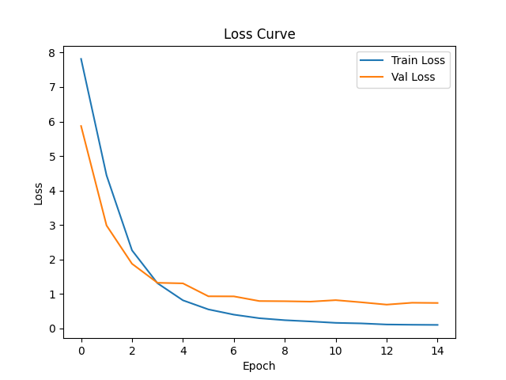
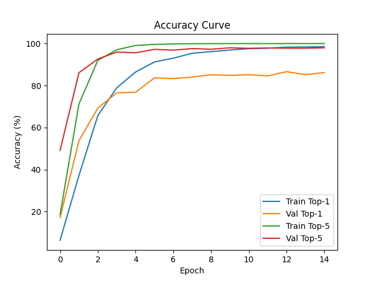
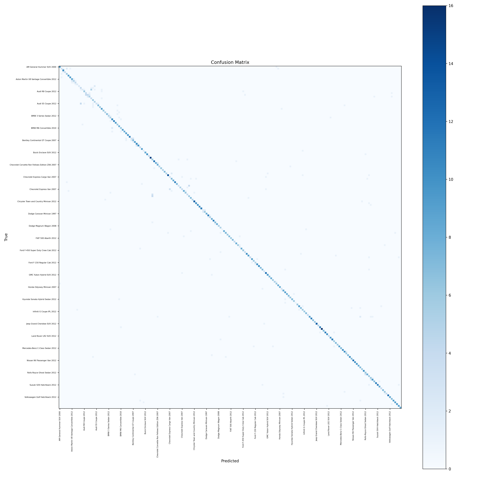
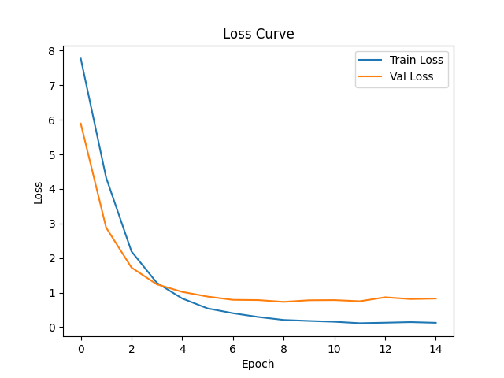
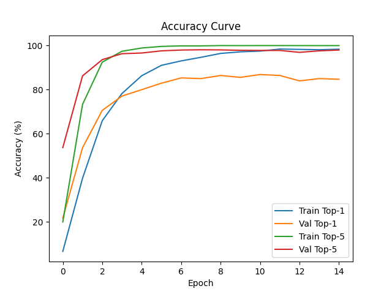
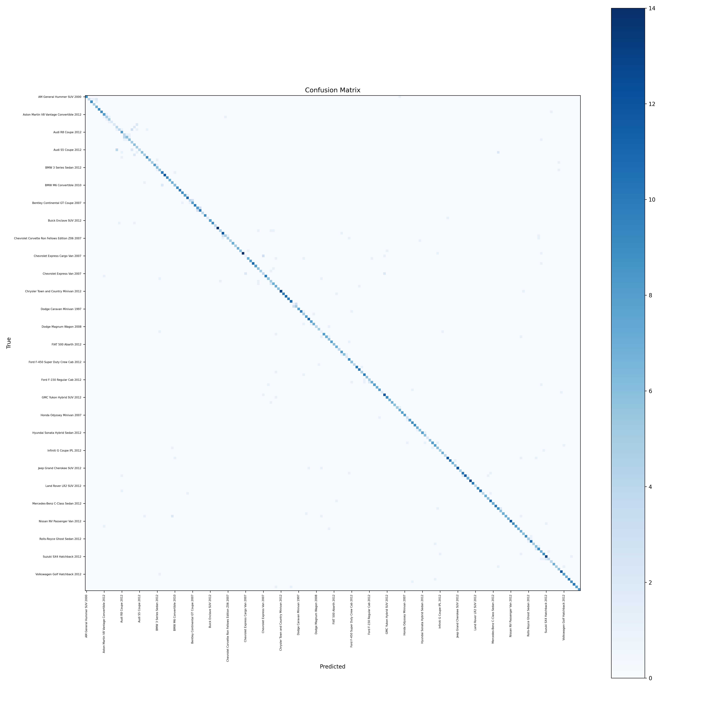
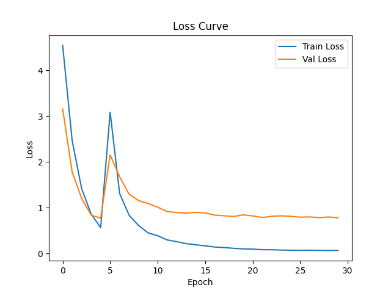
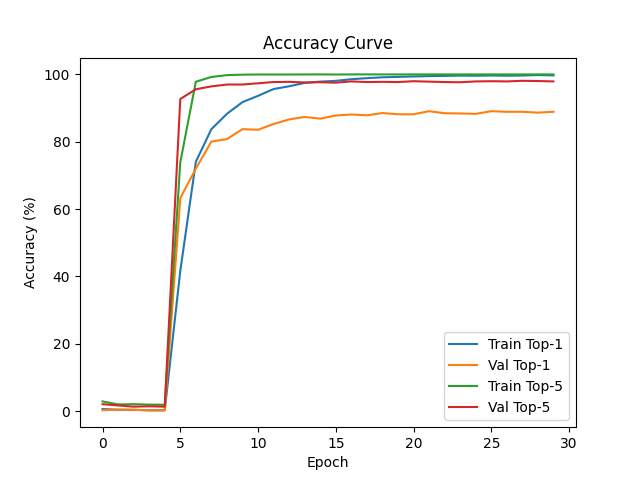
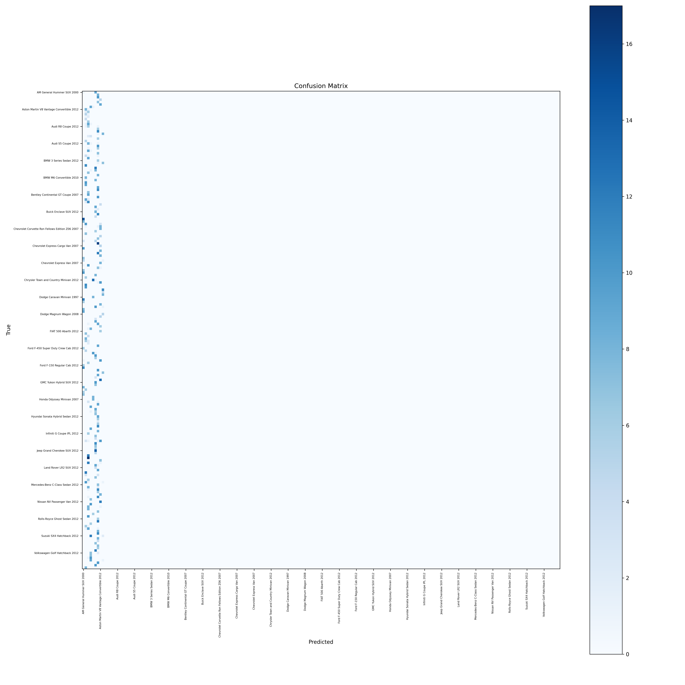

# Experiment Log

## Experiment: Baseline single head classification all layers except fc are frozen
**Date:** 2025-11-23 22:14:09

### Changes
None, this is the baseline

### Reason
Measure a baseline to compare to

### Metrics
- Epoch 1: train_loss=4.756690376425192, train_top1=8.749040675218161, train_top5=23.131235606617317, val_loss=4.186660209852468, val_top1=16.942909751222352, val_top5=40.3928790715957
- Epoch 2: train_loss=3.318053653143226, train_top1=45.80199539055755, train_top5=74.2133537883861, val_loss=3.6642330931036513, val_top1=26.826273779403657, val_top5=52.547575204192384
- Epoch 3: train_loss=2.490202739763882, train_top1=67.53645432912104, train_top5=89.37835764207935, val_loss=3.3278836059453227, val_top1=31.614487395687583, val_top5=58.37937382088621
- Epoch 4: train_loss=1.9122096590326094, train_top1=78.4036837960607, train_top5=94.52033767407433, val_loss=3.1242336076487054, val_top1=33.88581952469125, val_top5=60.589318595684844
- Epoch 5: train_loss=1.4882188129681215, train_top1=86.7996930079193, train_top5=97.65157329240215, val_loss=2.979874514157674, val_top1=36.218538984482535, val_top5=63.22897483821
- Epoch 6: train_loss=1.157973064849309, train_top1=91.972371454012, train_top5=98.87950882578664, val_loss=2.863996946423825, val_top1=37.38489869213163, val_top5=64.21117249378183
- Epoch 7: train_loss=0.9280253464866398, train_top1=94.7966231772832, train_top5=99.57022256331543, val_loss=2.781894972457558, val_top1=37.75322283960838, val_top5=65.13198281856604
- Epoch 8: train_loss=0.7499706934345565, train_top1=96.62317728904789, train_top5=99.78511128165772, val_loss=2.712803054397424, val_top1=39.472068758520194, val_top5=66.42111726858046
- Epoch 9: train_loss=0.6008788244228407, train_top1=98.25019187078234, train_top5=99.93860322333077, val_loss=2.6990522366495058, val_top1=40.27010433976822, val_top5=66.54389197699054
- Epoch 10: train_loss=0.49735733464600396, train_top1=98.98695318495778, train_top5=99.95395241749809, val_loss=2.6380398860367036, val_top1=40.085942277153116, val_top5=67.71025170688617
- Epoch 11: train_loss=0.41091016428066235, train_top1=99.38603223330774, train_top5=99.9846508058327, val_loss=2.6165183726229353, val_top1=41.74340084068903, val_top5=67.09637815312713
- Epoch 12: train_loss=0.3419807001982665, train_top1=99.5088257866462, train_top5=100.0, val_loss=2.583307102313431, val_top1=41.436464080201695, val_top5=68.13996318632141
- Epoch 13: train_loss=0.2891655498162106, train_top1=99.78511128165772, train_top5=100.0, val_loss=2.577523599598875, val_top1=40.76120318394632, val_top5=67.64886435268114
- Epoch 14: train_loss=0.24772838785478177, train_top1=99.80046047582502, train_top5=100.0, val_loss=2.542328888247392, val_top1=40.945365236023584, val_top5=68.75383672837175
- Epoch 15: train_loss=0.20891222185294445, train_top1=99.84650805832693, train_top5=100.0, val_loss=2.552252348103064, val_top1=41.19091465284372, val_top5=67.89441376950127
- hierarchical_consistency: 0.5316144874155924
- accuracy_Chrysler: 0.48333333333333334
- accuracy_Ford: 0.4897959183673469
- accuracy_Hyundai: 0.5542168674698795
- accuracy_GMC: 0.5609756097560976
- accuracy_Toyota: 0.59375
- accuracy_Chevrolet: 0.5638297872340425
- accuracy_smart: 0.625
- accuracy_Suzuki: 0.3902439024390244
- accuracy_Bentley: 0.5357142857142857
- accuracy_Dodge: 0.5535714285714286
- accuracy_Acura: 0.46938775510204084
- accuracy_Volvo: 0.4666666666666667
- accuracy_Audi: 0.6018518518518519
- accuracy_Mitsubishi: 0.16666666666666666
- accuracy_Ferrari: 0.8181818181818182
- accuracy_Jeep: 0.5116279069767442
- accuracy_Eagle: 0.5555555555555556
- accuracy_Land Rover: 0.6428571428571429
- accuracy_Mercedes-Benz: 0.509090909090909
- accuracy_BMW: 0.5363636363636364
- accuracy_Ram: 0.8333333333333334
- accuracy_Lincoln: 0.6666666666666666
- accuracy_Bugatti: 0.5833333333333334
- accuracy_Fisker: 0.1111111111111111
- accuracy_Aston Martin: 0.4230769230769231
- accuracy_Honda: 0.4482758620689655
- accuracy_Daewoo: 0.45454545454545453
- accuracy_Buick: 0.4583333333333333
- accuracy_McLaren: 0.5
- accuracy_Volkswagen: 0.37037037037037035
- accuracy_Lamborghini: 0.6326530612244898
- accuracy_Infiniti: 0.38461538461538464
- accuracy_Spyker: 0.8888888888888888
- accuracy_Plymouth: 0.75
- accuracy_HUMMER: 0.9230769230769231
- accuracy_Mazda: 0.5714285714285714
- accuracy_Cadillac: 0.26666666666666666
- accuracy_Nissan: 0.3684210526315789
- accuracy_Scion: 0.5
- accuracy_AM: 0.8
- accuracy_Jaguar: 0.2
- accuracy_Rolls-Royce: 0.42857142857142855
- accuracy_Isuzu: 0.75
- accuracy_Tesla: 0.5
- accuracy_Geo: 1.0
- accuracy_FIAT: 0.8461538461538461
- accuracy_MINI: 0.75
- accuracy_Maybach: 0.3333333333333333
- accuracy_Porsche: 0.42857142857142855

### Results
Best Top-1 Accuracy = 41.74%, Hierarchical Consistency = 0.5316

--- Starting Phase 1 Baseline Evaluation ---
Test Set Size: 8041
----------------------------------------
1. Exact Car Accuracy (Hard):  41.72%  (Target for fine-tuning)
2. Make/Brand Accuracy (Easy): 52.82%  (Target for coarse features)
----------------------------------------
3. THE GAP:                    11.09% points

### Gemini thoughts on accuracy above
1. Exact Accuracy (42%): This is your floor. Your model is getting less than half of the cars right.

2. Make Accuracy (53%): This is surprisingly low. It means that nearly half the time, the model doesn't even know it's looking at a "BMW" vs. a "Ford."

3. The Gap (11%): This proves your hypothesis: Hierarchy matters. The model is significantly better at the "Easy" task (Make) than the "Hard" task (Model), but because you are using a standard flat classifier, it isn't effectively leveraging the easy task to help solve the hard one.

### Notes
Training finished. Logged curves, confusion matrix, sample image.

### Images / Plots

---

## Experiment: Baseline single head classification unfrozen layers
**Date:** 2025-11-23 23:39:19

### Changes
Unfroze the rest of the model parameters, previously only the fc layer at the end was unfrozen and the ImageNet layers were frozen

### Reason
The model is using generic 'ImageNet' eyes. It knows what a 'wheel' is, but it doesn't know the specific shape of a '2012 BMW headlight.' 
 The hypothesis: Exact Accuracy should jump significantly (likely to 60-70%+).

### Metrics
- Epoch 1: train_loss=4.784462774925203, train_top1=7.5057559442995885, train_top5=20.69071373665049, val_loss=3.68499265162033, val_top1=21.11724984448259, val_top5=48.31184776287419
- Epoch 2: train_loss=2.4955783588924687, train_top1=49.13277053071825, train_top5=79.18649269859331, val_loss=1.8173698773041616, val_top1=57.76550030225329, val_top5=85.63535912538907
- Epoch 3: train_loss=0.9346095656397154, train_top1=82.5786646259627, train_top5=97.19109745918561, val_loss=1.2652581198366235, val_top1=69.42909756842532, val_top5=91.7127071354856
- Epoch 4: train_loss=0.31030790766934113, train_top1=95.88641596316194, train_top5=99.73906369915579, val_loss=1.023550943848251, val_top1=74.27869855062299, val_top5=93.43155305322655
- Epoch 5: train_loss=0.11305745982108259, train_top1=99.04834995342966, train_top5=99.9846508058327, val_loss=0.9354753313509506, val_top1=76.05893190218818, val_top5=93.6771024934641
- Epoch 6: train_loss=0.045973470542902954, train_top1=99.73906369915579, train_top5=100.0, val_loss=0.8813783135276546, val_top1=78.14610194515933, val_top5=94.29097609171625
- Epoch 7: train_loss=0.024903129536089582, train_top1=99.84650805832693, train_top5=100.0, val_loss=0.8596108256855796, val_top1=78.33026400777443, val_top5=93.92265196648604
- Epoch 8: train_loss=0.016833524169516126, train_top1=99.84650805832693, train_top5=100.0, val_loss=0.8592310819324355, val_top1=77.96193988254423, val_top5=94.229588657892
- Epoch 9: train_loss=0.012860797598660679, train_top1=99.90790483499616, train_top5=100.0, val_loss=0.8550251524751358, val_top1=77.77777770752553, val_top5=94.229588657892
- Epoch 10: train_loss=0.009989426578362905, train_top1=99.90790483499616, train_top5=100.0, val_loss=0.8674976508847184, val_top1=77.53222840310899, val_top5=93.79987717845675
- Epoch 11: train_loss=0.008886432010145802, train_top1=99.87720644666155, train_top5=100.0, val_loss=0.8710677714857168, val_top1=77.65500303189984, val_top5=94.29097609171625
- Epoch 12: train_loss=0.007135792681411286, train_top1=99.89255564082886, train_top5=100.0, val_loss=0.8540685079520725, val_top1=78.33026400777443, val_top5=94.4137507205071
- Epoch 13: train_loss=0.006611056273041188, train_top1=99.89255564082886, train_top5=100.0, val_loss=0.8955176870759972, val_top1=77.22529163208382, val_top5=93.92265188686682
- Epoch 14: train_loss=0.006172642445567701, train_top1=99.87720644666155, train_top5=100.0, val_loss=0.8960173458976933, val_top1=77.59361567769481, val_top5=94.22958873751121
- Epoch 15: train_loss=0.012592953730571847, train_top1=99.7544128933231, train_top5=99.9846508058327, val_loss=1.1438741295377195, val_top1=71.51626769101568, val_top5=91.28299565605037
- hierarchical_consistency: 0.8833640270104358
- accuracy_Chrysler: 0.8833333333333333
- accuracy_Ford: 0.9183673469387755
- accuracy_Hyundai: 0.8795180722891566
- accuracy_GMC: 0.8048780487804879
- accuracy_Toyota: 0.90625
- accuracy_Chevrolet: 0.8351063829787234
- accuracy_smart: 1.0
- accuracy_Suzuki: 0.9024390243902439
- accuracy_Bentley: 0.9285714285714286
- accuracy_Dodge: 0.9285714285714286
- accuracy_Acura: 0.8163265306122449
- accuracy_Volvo: 0.8666666666666667
- accuracy_Audi: 0.9166666666666666
- accuracy_Mitsubishi: 0.75
- accuracy_Ferrari: 1.0
- accuracy_Jeep: 0.9767441860465116
- accuracy_Eagle: 0.7777777777777778
- accuracy_Land Rover: 0.9285714285714286
- accuracy_Mercedes-Benz: 0.7818181818181819
- accuracy_BMW: 0.9090909090909091
- accuracy_Ram: 1.0
- accuracy_Lincoln: 1.0
- accuracy_Bugatti: 0.9583333333333334
- accuracy_Fisker: 0.7777777777777778
- accuracy_Aston Martin: 1.0
- accuracy_Honda: 0.9310344827586207
- accuracy_Daewoo: 0.8181818181818182
- accuracy_Buick: 0.875
- accuracy_McLaren: 0.8333333333333334
- accuracy_Volkswagen: 0.8148148148148148
- accuracy_Lamborghini: 0.8775510204081632
- accuracy_Infiniti: 0.8461538461538461
- accuracy_Spyker: 0.8888888888888888
- accuracy_Plymouth: 0.875
- accuracy_HUMMER: 0.8461538461538461
- accuracy_Mazda: 1.0
- accuracy_Cadillac: 0.7666666666666667
- accuracy_Nissan: 0.8421052631578947
- accuracy_Scion: 1.0
- accuracy_AM: 0.9
- accuracy_Jaguar: 0.6666666666666666
- accuracy_Rolls-Royce: 0.8928571428571429
- accuracy_Isuzu: 1.0
- accuracy_Tesla: 1.0
- accuracy_Geo: 1.0
- accuracy_FIAT: 0.9230769230769231
- accuracy_MINI: 0.9166666666666666
- accuracy_Maybach: 0.6666666666666666
- accuracy_Porsche: 0.8571428571428571

### Results
Best Top-1 Accuracy = 78.33%, Hierarchical Consistency = 0.8834

--- Starting Phase 2 Baseline Evaluation ---
Test Set Size: 8041
----------------------------------------
1. Exact Car Accuracy (Hard):  75.92%  (Target for fine-tuning)
2. Make/Brand Accuracy (Easy): 85.49%  (Target for coarse features)
----------------------------------------
3. THE GAP:                    9.56% points

### Notes from Gemini
This is a textbook result for your report. You have successfully created a strong narrative:

1. Phase 1 (Frozen): Acc ~42%. The model was blind to specific features.

1. Phase 2 (Fine-Tuned): Acc ~76%. The model learned the specific features, BUT the "Hierarchy Gap" barely moved (dropped from 11% to 9.5%).

The Narrative for the report:

"Fine-tuning improved raw performance, but it failed to solve the structural inconsistency. The model is still significantly better at guessing the Brand than the Car, implying it is learning them as separate tasks rather than a structured hierarchy. Phase 3 (Multi-Head) is designed to explicitly link these two tasks."

### Notes
Training finished. Logged curves, confusion matrix, sample image.

### Images / Plots

---

## Experiment: Multihead_two_heads
**Date:** 2025-11-24 18:20:10

### Changes
Added another classification head, so two in total. One head only predicts the make (Toyota, Mazda, Ford,...), The other predicts the full model label.

### Reason
We want to make sure that the model is learning the hierarchy. i.e., it at least gets better at predicting the 'easy' problem (make) and hoping for some improvement also for the 'hard' problem (full model label)

### Metrics
- Epoch 1: train_loss=7.946168717950102, train_top1=5.6792018419033, train_top5=17.405986184554198, val_loss=6.1999869121226014, val_top1=17.24984652751644, val_top5=45.365254738786014
- Epoch 2: train_loss=4.365030718545043, train_top1=43.13123561130152, train_top5=74.02916346072053, val_loss=3.2356772683309294, val_top1=51.626764902825585, val_top5=84.22344989905407
- Epoch 3: train_loss=1.7826110722738693, train_top1=75.34919416262201, train_top5=95.99386032233308, val_loss=2.116189131932876, val_top1=66.17556779555854, val_top5=90.11663592615473
- Epoch 4: train_loss=0.6796543514188765, train_top1=90.91327705295473, train_top5=99.53952417498081, val_loss=1.7306543238840635, val_top1=72.62124006670629, val_top5=92.14241869454007
- Epoch 5: train_loss=0.290493277543248, train_top1=96.89946277820414, train_top5=99.9846508058327, val_loss=1.5192235909480123, val_top1=75.32228357210856, val_top5=94.29097597931265
- Epoch 6: train_loss=0.1342286072002405, train_top1=99.21719109746738, train_top5=100.0, val_loss=1.4107489994217677, val_top1=76.55003071241103, val_top5=94.41375068772271
- Epoch 7: train_loss=0.06610052237260003, train_top1=99.70836531082118, train_top5=100.0, val_loss=1.370692363906448, val_top1=77.04112956946872, val_top5=94.65930010454285
- Epoch 8: train_loss=0.043140668175537036, train_top1=99.83115886415963, train_top5=100.0, val_loss=1.3732357099789503, val_top1=76.85696748343621, val_top5=94.72068745874788
- Epoch 9: train_loss=0.030294130302262325, train_top1=99.87720644666155, train_top5=100.0, val_loss=1.403000630067857, val_top1=77.59361567769481, val_top5=94.41375074392451
- Epoch 10: train_loss=0.024227657228571033, train_top1=99.87720644666155, train_top5=100.0, val_loss=1.353612500366951, val_top1=77.96193980292502, val_top5=94.22958862510761
- Epoch 11: train_loss=0.02020449945310035, train_top1=99.84650805832693, train_top5=100.0, val_loss=1.3687345451778836, val_top1=78.26887657395018, val_top5=94.29097597931265
- Epoch 12: train_loss=0.015681779668512752, train_top1=99.89255564082886, train_top5=100.0, val_loss=1.3449159399580561, val_top1=78.69858810958722, val_top5=94.29097603551445
- Epoch 13: train_loss=0.016340145225124184, train_top1=99.86185725249425, train_top5=100.0, val_loss=1.4388483062413955, val_top1=77.04112956946872, val_top5=93.98403926448927
- Epoch 14: train_loss=0.14596560577749748, train_top1=98.81811204911742, train_top5=99.95395241749809, val_loss=2.0433415961163113, val_top1=67.83302641529625, val_top5=90.17802333656157
- Epoch 15: train_loss=0.22840870121123694, train_top1=97.31389101252405, train_top5=99.95395241749809, val_loss=1.7162447706038708, val_top1=72.49846535829623, val_top5=91.89686927771993
- hierarchical_consistency: 0.8809085328422345
- accuracy_Chrysler: 0.9
- accuracy_Ford: 0.8979591836734694
- accuracy_Hyundai: 0.8554216867469879
- accuracy_GMC: 0.8292682926829268
- accuracy_Toyota: 0.875
- accuracy_Chevrolet: 0.824468085106383
- accuracy_smart: 1.0
- accuracy_Suzuki: 0.7073170731707317
- accuracy_Bentley: 0.9285714285714286
- accuracy_Dodge: 0.8839285714285714
- accuracy_Acura: 0.8775510204081632
- accuracy_Volvo: 0.9
- accuracy_Audi: 0.8981481481481481
- accuracy_Mitsubishi: 0.75
- accuracy_Ferrari: 0.9545454545454546
- accuracy_Jeep: 0.9302325581395349
- accuracy_Eagle: 0.7777777777777778
- accuracy_Land Rover: 0.9285714285714286
- accuracy_Mercedes-Benz: 0.8181818181818182
- accuracy_BMW: 0.9363636363636364
- accuracy_Ram: 1.0
- accuracy_Lincoln: 0.8888888888888888
- accuracy_Bugatti: 0.9583333333333334
- accuracy_Fisker: 0.7777777777777778
- accuracy_Aston Martin: 1.0
- accuracy_Honda: 0.9310344827586207
- accuracy_Daewoo: 0.9090909090909091
- accuracy_Buick: 0.875
- accuracy_McLaren: 1.0
- accuracy_Volkswagen: 0.9259259259259259
- accuracy_Lamborghini: 0.9183673469387755
- accuracy_Infiniti: 0.9230769230769231
- accuracy_Spyker: 0.8888888888888888
- accuracy_Plymouth: 0.875
- accuracy_HUMMER: 0.8461538461538461
- accuracy_Mazda: 0.7142857142857143
- accuracy_Cadillac: 0.8666666666666667
- accuracy_Nissan: 0.8421052631578947
- accuracy_Scion: 1.0
- accuracy_AM General: 1.0
- accuracy_Jaguar: 0.8666666666666667
- accuracy_Rolls-Royce: 0.8571428571428571
- accuracy_Isuzu: 1.0
- accuracy_Tesla: 1.0
- accuracy_Geo: 1.0
- accuracy_FIAT: 0.9230769230769231
- accuracy_MINI: 0.8333333333333334
- accuracy_Maybach: 0.8333333333333334
- accuracy_Porsche: 0.7142857142857143

### Top-1 Accuracy per Epoch
[5.6792018419033, 17.24984652751644, 43.13123561130152, 51.626764902825585, 75.34919416262201, 66.17556779555854, 90.91327705295473, 72.62124006670629, 96.89946277820414, 75.32228357210856, 99.21719109746738, 76.55003071241103, 99.70836531082118, 77.04112956946872, 99.83115886415963, 76.85696748343621, 99.87720644666155, 77.59361567769481, 99.87720644666155, 77.96193980292502, 99.84650805832693, 78.26887657395018, 99.89255564082886, 78.69858810958722, 99.86185725249425, 77.04112956946872, 98.81811204911742, 67.83302641529625, 97.31389101252405, 72.49846535829623]

### Top-5 Accuracy per Epoch
[17.405986184554198, 45.365254738786014, 74.02916346072053, 84.22344989905407, 95.99386032233308, 90.11663592615473, 99.53952417498081, 92.14241869454007, 99.9846508058327, 94.29097597931265, 100.0, 94.41375068772271, 100.0, 94.65930010454285, 100.0, 94.72068745874788, 100.0, 94.41375074392451, 100.0, 94.22958862510761, 100.0, 94.29097597931265, 100.0, 94.29097603551445, 100.0, 93.98403926448927, 99.95395241749809, 90.17802333656157, 99.95395241749809, 91.89686927771993]

### Results
Best Top-1 Accuracy = 78.70%, Hierarchical Consistency = 0.8809

--- Starting Phase 3 (Multi-Head) Evaluation ---
Test Set Size: 8041
----------------------------------------
1. Model Head Accuracy:    77.20% (The Hard Task)
2. Make Head Accuracy:     85.51% (The Easy Task)
----------------------------------------
3. THE GAP:                8.31% points
4. Internal Consistency:   90.44% (How often heads agree)

### Notes from Gemini

1. Why did Exact Accuracy go up? (75.9% $\to$ 77.2%) By forcing the model to answer "What Brand is this?", you gave the shared backbone (the ResNet feature extractor) a strong hint. It learned features that are distinct to specific brands (like BMW grilles or Porsche headlights) which helped the specific Car classifier do its job better. This is called Auxiliary Task Learning.
2. Why is Consistency only 90%? This is the "Frankenstein Problem." In ~9.5% of your test set (approx. 760 images), your model is confused.Head 1 says: "This is a Toyota."Head 2 says: "This is a Honda Civic."Currently, your loss function (loss_make + loss_model) treats these as separate problems. It doesn't strictly punish the model for disagreeing with itself.

### Notes
Training finished. Logged curves, confusion matrix, sample image.

### Images / Plots

---

## Experiment: Multihead_two_heads_with_data_augmentation
**Date:** 2025-11-25 00:45:30

### Changes
Added data augmentation

### Reason
Try to prevent the model from overfitting, and force the network to learn more robust features that remain consistent regardless of position or lighting

### Metrics
- Epoch 1: train_loss=7.815932121408599, train_top1=6.3545663851183924, train_top5=18.633921712083442, val_loss=5.869649592025504, val_top1=17.127071824375292, val_top5=49.23265805604488
- Epoch 2: train_loss=4.440406470543956, train_top1=37.20644665745159, train_top5=71.26630851646067, val_loss=2.9865334792104945, val_top1=53.77532227892609, val_top5=86.12645798244675
- Epoch 3: train_loss=2.2660845409241075, train_top1=65.74059861388832, train_top5=91.98772064466615, val_loss=1.8759257547543633, val_top1=69.24493555030331, val_top5=92.63351747197854
- Epoch 4: train_loss=1.3119086706903653, train_top1=78.91020721177915, train_top5=97.03760553156515, val_loss=1.3241887091126743, val_top1=76.55003067962666, val_top5=95.94843462246777
- Epoch 5: train_loss=0.8161561346932366, train_top1=86.44666155612386, train_top5=99.07904834176428, val_loss=1.307684128345925, val_top1=76.79558009644678, val_top5=95.58011041761836
- Epoch 6: train_loss=0.5526671981774928, train_top1=91.22026093395874, train_top5=99.58557175748273, val_loss=0.9327849331920757, val_top1=83.67096376741057, val_top5=97.23756898115427
- Epoch 7: train_loss=0.4003552406271512, train_top1=93.04681503401294, train_top5=99.84650805832693, val_loss=0.9303494195692228, val_top1=83.30263960939598, val_top5=96.86924493554328
- Epoch 8: train_loss=0.2971951404353425, train_top1=95.37989256149608, train_top5=99.92325402916347, val_loss=0.7951233823508701, val_top1=84.03928783643897, val_top5=97.60589310638447
- Epoch 9: train_loss=0.24003008695538008, train_top1=96.1627014499761, train_top5=99.96930161166539, val_loss=0.790080186375231, val_top1=85.1442602917488, val_top5=97.29895641497852
- Epoch 10: train_loss=0.2039741998142402, train_top1=96.93016116653875, train_top5=100.0, val_loss=0.7779739049404512, val_top1=84.83732354414104, val_top5=97.97421728781647
- Epoch 11: train_loss=0.16267433200354586, train_top1=97.55947812739831, train_top5=99.9846508058327, val_loss=0.8212023883454268, val_top1=85.20564764595383, val_top5=97.72866781479453
- Epoch 12: train_loss=0.1468852491810609, train_top1=97.78971604576316, train_top5=99.96930161166539, val_loss=0.7591619299115251, val_top1=84.59177402428428, val_top5=97.91282995702885
- Epoch 13: train_loss=0.11502583502625284, train_top1=98.26554105089704, train_top5=100.0, val_loss=0.6912202439548195, val_top1=86.6175567926696, val_top5=97.79005524861878
- Epoch 14: train_loss=0.10746147307129156, train_top1=98.37298541006818, train_top5=100.0, val_loss=0.7455345008766966, val_top1=85.20564764595383, val_top5=97.79005522520137
- Epoch 15: train_loss=0.10319699632005333, train_top1=98.5264773599386, train_top5=99.9846508058327, val_loss=0.739026231623779, val_top1=86.18784525703256, val_top5=97.97421723161467
- hierarchical_consistency: 0.94536525475752
- accuracy_Chrysler: 0.9166666666666666
- accuracy_Ford: 0.9183673469387755
- accuracy_Hyundai: 0.9397590361445783
- accuracy_GMC: 0.9512195121951219
- accuracy_Toyota: 0.9375
- accuracy_Chevrolet: 0.9202127659574468
- accuracy_smart: 1.0
- accuracy_Suzuki: 0.926829268292683
- accuracy_Bentley: 1.0
- accuracy_Dodge: 0.9464285714285714
- accuracy_Acura: 0.9795918367346939
- accuracy_Volvo: 0.9
- accuracy_Audi: 0.9259259259259259
- accuracy_Mitsubishi: 0.8333333333333334
- accuracy_Ferrari: 0.9545454545454546
- accuracy_Jeep: 0.9767441860465116
- accuracy_Eagle: 0.7777777777777778
- accuracy_Land Rover: 1.0
- accuracy_Mercedes-Benz: 0.9272727272727272
- accuracy_BMW: 0.9818181818181818
- accuracy_Ram: 1.0
- accuracy_Lincoln: 1.0
- accuracy_Bugatti: 1.0
- accuracy_Fisker: 0.8888888888888888
- accuracy_Aston Martin: 1.0
- accuracy_Honda: 0.9655172413793104
- accuracy_Daewoo: 1.0
- accuracy_Buick: 0.9583333333333334
- accuracy_McLaren: 1.0
- accuracy_Volkswagen: 0.8888888888888888
- accuracy_Lamborghini: 0.9591836734693877
- accuracy_Infiniti: 1.0
- accuracy_Spyker: 1.0
- accuracy_Plymouth: 1.0
- accuracy_HUMMER: 0.9230769230769231
- accuracy_Mazda: 1.0
- accuracy_Cadillac: 0.9666666666666667
- accuracy_Nissan: 1.0
- accuracy_Scion: 1.0
- accuracy_AM General: 0.9
- accuracy_Jaguar: 0.6
- accuracy_Rolls-Royce: 0.9642857142857143
- accuracy_Isuzu: 1.0
- accuracy_Tesla: 1.0
- accuracy_Geo: 1.0
- accuracy_FIAT: 1.0
- accuracy_MINI: 0.9166666666666666
- accuracy_Maybach: 1.0
- accuracy_Porsche: 1.0

### Top-1 Accuracy per Epoch
[6.3545663851183924, 17.127071824375292, 37.20644665745159, 53.77532227892609, 65.74059861388832, 69.24493555030331, 78.91020721177915, 76.55003067962666, 86.44666155612386, 76.79558009644678, 91.22026093395874, 83.67096376741057, 93.04681503401294, 83.30263960939598, 95.37989256149608, 84.03928783643897, 96.1627014499761, 85.1442602917488, 96.93016116653875, 84.83732354414104, 97.55947812739831, 85.20564764595383, 97.78971604576316, 84.59177402428428, 98.26554105089704, 86.6175567926696, 98.37298541006818, 85.20564764595383, 98.5264773599386, 86.18784525703256]

### Top-5 Accuracy per Epoch
[18.633921712083442, 49.23265805604488, 71.26630851646067, 86.12645798244675, 91.98772064466615, 92.63351747197854, 97.03760553156515, 95.94843462246777, 99.07904834176428, 95.58011041761836, 99.58557175748273, 97.23756898115427, 99.84650805832693, 96.86924493554328, 99.92325402916347, 97.60589310638447, 99.96930161166539, 97.29895641497852, 100.0, 97.97421728781647, 99.9846508058327, 97.72866781479453, 99.96930161166539, 97.91282995702885, 100.0, 97.79005524861878, 100.0, 97.79005522520137, 99.9846508058327, 97.97421723161467]

### Results
Best Top-1 Accuracy = 86.62%, Hierarchical Consistency = 0.9454

--- Starting Phase 4 (Multi-Head + Data Augmentation) Evaluation ---
Test Set Size: 8041
----------------------------------------
1. Model Head Accuracy:    85.65% (The Hard Task)
2. Make Head Accuracy:     92.71% (The Easy Task)
----------------------------------------
3. THE GAP:                7.06% points
4. Internal Consistency:   95.26% (How often heads agree)

### Notes from Gemini
1. The "Ceiling" was Shattered (Make Acc: 85% $\to$ 92%)Remember how in Phase 3 we were worried that "Make Accuracy" was stuck at 85%?Hypothesis: We thought the ResNet backbone had hit its capacity.Correction: It wasn't capacity; it was overfitting. The model had memorized the "clean" images perfectly but failed on slight variations. Data Augmentation forced it to learn robust features (like the shape of a grille regardless of angle), which instantly unlocked that extra 7% accuracy.
2. The "Free Lunch" (Model Acc: +8.45%)You gained nearly 8.5% accuracy on the hardest task without changing your architecture or training longer. This demonstrates why Data Augmentation is standard practice in Deep Learning: it converts "memorization" into "generalization."
3. Consistency Improved Automatically (90% $\to$ 95%)Interestingly, your consistency error was cut in half (from ~10% to ~5%).Why? When the model is more confident and robust about the image features, its two heads naturally agree more often. The "confused" cases (where Head 1 says Ford and Head 2 says Civic) usually happen on "weird" images. Augmentation made the model less confused by "weird" images.

### Notes
Training finished. Logged curves, confusion matrix, sample image.

### Images / Plots

---

## Experiment: Multihead_two_heads_with_da_and_class_balancing
**Date:** 2025-11-25 13:33:46

### Changes
Weighted the rarer classes so that the model doesn't ignore those

### Reason
Want the model to perform better on rarer classes

### Metrics
- Epoch 1: train_loss=7.772945845538803, train_top1=6.630851880129904, train_top5=19.984650801734016, val_loss=5.8928094085847915, val_top1=21.731123384483904, val_top5=53.713934901303645
- Epoch 2: train_loss=4.329586911146584, train_top1=39.80046047465397, train_top5=73.29240213834773, val_loss=2.8823960661668586, val_top1=53.65254757051603, val_top5=86.2492326112376
- Epoch 3: train_loss=2.1918791427304902, train_top1=65.90943974738659, train_top5=92.47889485801996, val_loss=1.7251405352972415, val_top1=70.59545735452276, val_top5=93.61571519546088
- Epoch 4: train_loss=1.2835763503657975, train_top1=78.26554105441019, train_top5=97.42133537989255, val_loss=1.2396522223254227, val_top1=77.10251686747196, val_top5=96.31675872428056
- Epoch 5: train_loss=0.8304193948656435, train_top1=86.32386798639071, train_top5=98.89485801995396, val_loss=1.0214327933087242, val_top1=79.98772249169113, val_top5=96.62369551872314
- Epoch 6: train_loss=0.5426363576675322, train_top1=91.03607060980632, train_top5=99.6162701516726, val_loss=0.8855045299137787, val_top1=82.93431546074837, val_top5=97.60589310638447
- Epoch 7: train_loss=0.4036317541612082, train_top1=93.04681504806554, train_top5=99.86185725249425, val_loss=0.7910063673631774, val_top1=85.32842227474468, val_top5=97.97421723161467
- Epoch 8: train_loss=0.2948092286621527, train_top1=94.6738296157474, train_top5=99.86185725249425, val_loss=0.783593826238329, val_top1=85.02148560675614, val_top5=98.09699201964395
- Epoch 9: train_loss=0.2090779694633491, train_top1=96.4389869449876, train_top5=100.0, val_loss=0.7316315949804729, val_top1=86.43339469727012, val_top5=98.03560466543892
- Epoch 10: train_loss=0.18019591937683585, train_top1=97.160399070851, train_top5=99.9846508058327, val_loss=0.7785721142245188, val_top1=85.57397173839965, val_top5=97.85144260282382
- Epoch 11: train_loss=0.1562585013720592, train_top1=97.49808134253173, train_top5=100.0, val_loss=0.7829474898259869, val_top1=86.86310617670536, val_top5=97.79005524861878
- Epoch 12: train_loss=0.11472011142205205, train_top1=98.41903299257011, train_top5=100.0, val_loss=0.7498618792982611, val_top1=86.43339464106832, val_top5=97.79005524861878
- Epoch 13: train_loss=0.12925078234737503, train_top1=98.2655410590944, train_top5=99.9846508058327, val_loss=0.8652982929134896, val_top1=83.97790048223393, val_top5=96.93063221012909
- Epoch 14: train_loss=0.1459440808385862, train_top1=98.11204911742134, train_top5=99.9846508058327, val_loss=0.814074766350495, val_top1=85.02148558333873, val_top5=97.60589318600368
- Epoch 15: train_loss=0.12628492799431018, train_top1=98.35763621590088, train_top5=99.9846508058327, val_loss=0.8279479582519016, val_top1=84.71454881231357, val_top5=97.97421731123389
- hierarchical_consistency: 0.9459791282995703
- accuracy_Chrysler: 0.95
- accuracy_Ford: 0.9387755102040817
- accuracy_Hyundai: 0.963855421686747
- accuracy_GMC: 0.9024390243902439
- accuracy_Toyota: 0.9375
- accuracy_Chevrolet: 0.9042553191489362
- accuracy_smart: 1.0
- accuracy_Suzuki: 0.926829268292683
- accuracy_Bentley: 1.0
- accuracy_Dodge: 0.9553571428571429
- accuracy_Acura: 0.9795918367346939
- accuracy_Volvo: 0.9
- accuracy_Audi: 0.9722222222222222
- accuracy_Mitsubishi: 0.5833333333333334
- accuracy_Ferrari: 1.0
- accuracy_Jeep: 0.9534883720930233
- accuracy_Eagle: 0.8888888888888888
- accuracy_Land Rover: 1.0
- accuracy_Mercedes-Benz: 0.9454545454545454
- accuracy_BMW: 0.9727272727272728
- accuracy_Ram: 1.0
- accuracy_Lincoln: 1.0
- accuracy_Bugatti: 1.0
- accuracy_Fisker: 1.0
- accuracy_Aston Martin: 0.9615384615384616
- accuracy_Honda: 0.9655172413793104
- accuracy_Daewoo: 1.0
- accuracy_Buick: 0.9583333333333334
- accuracy_McLaren: 1.0
- accuracy_Volkswagen: 0.9259259259259259
- accuracy_Lamborghini: 0.9183673469387755
- accuracy_Infiniti: 0.9230769230769231
- accuracy_Spyker: 1.0
- accuracy_Plymouth: 0.875
- accuracy_HUMMER: 1.0
- accuracy_Mazda: 1.0
- accuracy_Cadillac: 0.9333333333333333
- accuracy_Nissan: 0.9473684210526315
- accuracy_Scion: 0.8333333333333334
- accuracy_AM General: 0.9
- accuracy_Jaguar: 0.8
- accuracy_Rolls-Royce: 1.0
- accuracy_Isuzu: 1.0
- accuracy_Tesla: 1.0
- accuracy_Geo: 1.0
- accuracy_FIAT: 1.0
- accuracy_MINI: 0.9166666666666666
- accuracy_Maybach: 0.6666666666666666
- accuracy_Porsche: 1.0

### Top-1 Accuracy per Epoch
[6.630851880129904, 21.731123384483904, 39.80046047465397, 53.65254757051603, 65.90943974738659, 70.59545735452276, 78.26554105441019, 77.10251686747196, 86.32386798639071, 79.98772249169113, 91.03607060980632, 82.93431546074837, 93.04681504806554, 85.32842227474468, 94.6738296157474, 85.02148560675614, 96.4389869449876, 86.43339469727012, 97.160399070851, 85.57397173839965, 97.49808134253173, 86.86310617670536, 98.41903299257011, 86.43339464106832, 98.2655410590944, 83.97790048223393, 98.11204911742134, 85.02148558333873, 98.35763621590088, 84.71454881231357]

### Top-5 Accuracy per Epoch
[19.984650801734016, 53.713934901303645, 73.29240213834773, 86.2492326112376, 92.47889485801996, 93.61571519546088, 97.42133537989255, 96.31675872428056, 98.89485801995396, 96.62369551872314, 99.6162701516726, 97.60589310638447, 99.86185725249425, 97.97421723161467, 99.86185725249425, 98.09699201964395, 100.0, 98.03560466543892, 99.9846508058327, 97.85144260282382, 100.0, 97.79005524861878, 100.0, 97.79005524861878, 99.9846508058327, 96.93063221012909, 99.9846508058327, 97.60589318600368, 99.9846508058327, 97.97421731123389]

### Results
Best Top-1 Accuracy = 86.86%, Hierarchical Consistency = 0.9460

--- Starting Phase 5 (Multi-Head with DA and Class Balancing) Evaluation ---
Test Set Size: 8041
----------------------------------------
1. Model Head Accuracy:    86.02% (The Hard Task)
2. Make Head Accuracy:     91.77% (The Easy Task)
----------------------------------------
3. THE GAP:                5.75% points
4. Internal Consistency:   94.42% (How often heads agree)

### Notes from Gemini
The Trade-off Analysis (Crucial for your Report)
You might notice that while your Model Accuracy went up (85.65% $\to$ 86.02%), your Make Accuracy and Consistency actually dropped slightly.
Why did this happen?This is the "Robin Hood Effect" of Class Balancing.
    - Before: The model ignored rare cars to maximize its score on common cars (like Fords and Toyotas). Since Fords are easy to recognize, consistency was high.
    - After: You forced the model to care about rare cars (like a "Spyker"). These are harder to recognize. By paying attention to them, the model takes more risks, leading to a slight drop in "easy" consistency but a net gain in "hard" truth.

### Notes
Training finished. Logged curves, confusion matrix, sample image.

### Images / Plots

---

## Experiment: 3_head
**Date:** 2025-11-26 16:28:15

### Changes
Added a third head so it goes Make -> Type -> Model

### Reason
Hope the extra hierarchical layer will result in better accuracy

### Metrics
- Epoch 1: train_loss=9.32982631962938, train_top1=5.479662314215168, train_top5=18.311588642767365, val_loss=6.753651829714275, val_top1=17.004297115965223, val_top5=51.07427867048719
- Epoch 2: train_loss=5.447631686262597, train_top1=35.79432079991467, train_top5=71.17421335731208, val_loss=3.651865949507796, val_top1=53.52977287147292, val_top5=86.67894414687464
- Epoch 3: train_loss=2.9802512098987197, train_top1=64.34382194759108, train_top5=92.07981581552525, val_loss=2.3503097182332993, val_top1=67.03499076379597, val_top5=94.10681391669755
- Epoch 4: train_loss=1.8044331827990752, train_top1=77.92785879326891, train_top5=96.94551036070607, val_loss=1.7932930914736585, val_top1=75.0153468572852, val_top5=95.64149782802518
- Epoch 5: train_loss=1.142799296108284, train_top1=85.81734458706696, train_top5=98.80276285495012, val_loss=1.448771838983778, val_top1=79.25107420844634, val_top5=96.68508284951076
- Epoch 6: train_loss=0.7961056835543442, train_top1=90.11511896211005, train_top5=99.64696853415195, val_loss=1.1947278803736978, val_top1=83.97790053843573, val_top5=97.36034368956433
- Epoch 7: train_loss=0.5834485125011055, train_top1=92.34075211636944, train_top5=99.80046047582502, val_loss=1.1793689951712256, val_top1=83.6709638142454, val_top5=97.85144260282382
- Epoch 8: train_loss=0.4582695790098341, train_top1=94.19800460475825, train_top5=99.89255564082886, val_loss=1.067003707932577, val_top1=85.38980967578455, val_top5=97.97421723161467
- Epoch 9: train_loss=0.35099240009910954, train_top1=95.64082886234029, train_top5=99.9846508058327, val_loss=1.01846350951748, val_top1=87.23143035813736, val_top5=98.09699194002474
- Epoch 10: train_loss=0.2784007107351527, train_top1=96.86876437933007, train_top5=99.96930161166539, val_loss=1.0288913786374696, val_top1=86.37200731964766, val_top5=98.03560466543892
- Epoch 11: train_loss=0.24347815458260402, train_top1=97.11435150240169, train_top5=99.9846508058327, val_loss=1.0015777904172116, val_top1=85.88090850942481, val_top5=98.0356045858197
- Epoch 12: train_loss=0.20427650777724551, train_top1=97.72831926323867, train_top5=100.0, val_loss=1.0120459231516568, val_top1=86.61755681608702, val_top5=98.0356045858197
- Epoch 13: train_loss=0.16581672369999237, train_top1=98.15809669992325, train_top5=100.0, val_loss=0.9565192327095439, val_top1=87.23143030193556, val_top5=98.52670349907919
- Epoch 14: train_loss=0.18332641928907734, train_top1=98.03530314658481, train_top5=99.96930161166539, val_loss=0.9950707791552652, val_top1=86.2492326112376, val_top5=97.79005522520137
- Epoch 15: train_loss=0.17072010723701003, train_top1=98.3883346042355, train_top5=100.0, val_loss=1.046798050147467, val_top1=86.37200735243205, val_top5=97.91282995702885
- hierarchical_consistency: 0.02394106813996317
- accuracy_Chrysler: 0.0
- accuracy_Ford: 0.0
- accuracy_Hyundai: 0.0
- accuracy_GMC: 0.0
- accuracy_Toyota: 0.0
- accuracy_Chevrolet: 0.0
- accuracy_smart: 0.0
- accuracy_Suzuki: 0.0
- accuracy_Bentley: 0.0
- accuracy_Dodge: 0.0
- accuracy_Acura: 0.7959183673469388
- accuracy_Volvo: 0.0
- accuracy_Audi: 0.0
- accuracy_Mitsubishi: 0.0
- accuracy_Ferrari: 0.0
- accuracy_Jeep: 0.0
- accuracy_Eagle: 0.0
- accuracy_Land Rover: 0.0
- accuracy_Mercedes-Benz: 0.0
- accuracy_BMW: 0.0
- accuracy_Ram: 0.0
- accuracy_Lincoln: 0.0
- accuracy_Bugatti: 0.0
- accuracy_Fisker: 0.0
- accuracy_Aston Martin: 0.0
- accuracy_Honda: 0.0
- accuracy_Daewoo: 0.0
- accuracy_Buick: 0.0
- accuracy_McLaren: 0.0
- accuracy_Volkswagen: 0.0
- accuracy_Lamborghini: 0.0
- accuracy_Infiniti: 0.0
- accuracy_Spyker: 0.0
- accuracy_Plymouth: 0.0
- accuracy_HUMMER: 0.0
- accuracy_Mazda: 0.0
- accuracy_Cadillac: 0.0
- accuracy_Nissan: 0.0
- accuracy_Scion: 0.0
- accuracy_AM General: 0.0
- accuracy_Jaguar: 0.0
- accuracy_Rolls-Royce: 0.0
- accuracy_Isuzu: 0.0
- accuracy_Tesla: 0.0
- accuracy_Geo: 0.0
- accuracy_FIAT: 0.0
- accuracy_MINI: 0.0
- accuracy_Maybach: 0.0
- accuracy_Porsche: 0.0

### Top-1 Accuracy per Epoch
[5.479662314215168, 17.004297115965223, 35.79432079991467, 53.52977287147292, 64.34382194759108, 67.03499076379597, 77.92785879326891, 75.0153468572852, 85.81734458706696, 79.25107420844634, 90.11511896211005, 83.97790053843573, 92.34075211636944, 83.6709638142454, 94.19800460475825, 85.38980967578455, 95.64082886234029, 87.23143035813736, 96.86876437933007, 86.37200731964766, 97.11435150240169, 85.88090850942481, 97.72831926323867, 86.61755681608702, 98.15809669992325, 87.23143030193556, 98.03530314658481, 86.2492326112376, 98.3883346042355, 86.37200735243205]

### Top-5 Accuracy per Epoch
[18.311588642767365, 51.07427867048719, 71.17421335731208, 86.67894414687464, 92.07981581552525, 94.10681391669755, 96.94551036070607, 95.64149782802518, 98.80276285495012, 96.68508284951076, 99.64696853415195, 97.36034368956433, 99.80046047582502, 97.85144260282382, 99.89255564082886, 97.97421723161467, 99.9846508058327, 98.09699194002474, 99.96930161166539, 98.03560466543892, 99.9846508058327, 98.0356045858197, 100.0, 98.0356045858197, 100.0, 98.52670349907919, 99.96930161166539, 97.79005522520137, 100.0, 97.91282995702885]

### Results
Best Top-1 Accuracy = 87.23%, Hierarchical Consistency = 0.0239

--- Starting Phase 6 (3-Head) Evaluation ---
Test Set Size: 8041
----------------------------------------
1. Model Head Accuracy:    85.36% (The Hard Task)
2. Type Head Accuracy:     93.06% (The Medium Task)
3. Make Head Accuracy:     91.94% (The Easy Task)
----------------------------------------
4. Make-Model Consistency:   94.44% (Brand Matches Car)
5. Type-Model Consistency:   94.98% (Type Matches Car)
----------------------------------------
Make-Gap:  6.58%
Type-Gap:   7.70%

### Notes from Gemini

1. The "Task Interference" PhenomenonYour Hard Accuracy (Model) dropped slightly: 86.02% $\to$ 85.36%.
    - Why? You added a third boss (the "Type" head). Now the ResNet backbone is trying to satisfy three different masters at the same time from Epoch 0.
    - The Conflict: The gradients from the "Type" loss are pulling the weights one way (focus on shape), while the "Make" loss pulls another (focus on logos/grilles), and the "Model" loss pulls a third. This "noise" early in training prevented the backbone from fine-tuning the Model features as perfectly as before.
2. The "Type" Hypothesis was Correct
    Your Type Accuracy (93.06%) is higher than your Make Accuracy (91.94%).
    - Interpretation: It is easier for the model to see that a car is a "Sedan" (Type) than to see it is a "Ford" (Make).
    - Strategic Value: This proves that "Type" is the perfect Intermediate Scaffolding. If you teach the model "Type" first (via Curriculum Learning), you build a massive, stable foundation of features that the "Model Head" can later use to get that score back above 86%.

### Notes
Training finished. Logged curves, confusion matrix, sample image.

### Images / Plots

---

## Experiment: 3_head_curriculum_learning
**Date:** 2025-11-26 18:42:01

### Changes
Curriculum learning with the 3 head model. For the first 5 epochs the model only trains Make and Type heads. Then it starts training Model head

### Reason
Want the model to learn the easy and medium tasks first before focusing on learning the harder task (differentiating between models)

### Metrics
- Epoch 1: train_loss=4.580847987118631, train_top1=0.6293169608595549, train_top5=2.8702993092862625, val_loss=3.114430477313281, val_top1=0.3683241252302026, val_top5=2.578268876611418
- Epoch 2: train_loss=2.4855471657316044, train_top1=0.7214121258633922, train_top5=3.0237912508129434, val_loss=1.823061449971208, val_top1=0.6138735420503376, val_top5=3.0079803550221422
- Epoch 3: train_loss=1.4232661629125694, train_top1=0.6907137375287797, train_top5=2.854950114972575, val_loss=1.1662501511652825, val_top1=0.6138735420503376, val_top5=2.885205646612075
- Epoch 4: train_loss=0.8335868630240902, train_top1=0.5065234075211051, train_top5=2.808902532617038, val_loss=0.9813216867587404, val_top1=0.9208103130755064, val_top5=2.4554941682013505
- Epoch 5: train_loss=0.5705175682936644, train_top1=0.5986185725249424, train_top5=2.5172678434382196, val_loss=0.8192884581011449, val_top1=0.6752608962553714, val_top5=2.4554941671768384
- Epoch 6: train_loss=3.386254566409271, train_top1=42.51726784460927, train_top5=74.48963929159497, val_loss=2.268815608168029, val_top1=64.02701040774932, val_top5=94.53652542891716
- Epoch 7: train_loss=1.4526606804393203, train_top1=76.1933998359686, train_top5=98.15809669992325, val_loss=1.6998853187315153, val_top1=74.40147325903305, val_top5=96.37814602228379
- Epoch 8: train_loss=0.9410825479424009, train_top1=84.0828856543587, train_top5=99.17114351496546, val_loss=1.3114753562735224, val_top1=78.69858807680284, val_top5=97.23756906077348
- Epoch 9: train_loss=0.632857930870671, train_top1=89.20951649804162, train_top5=99.70836531082118, val_loss=1.240549970946479, val_top1=82.2590546206948, val_top5=97.48311845417619
- Epoch 10: train_loss=0.47602228595948826, train_top1=92.00306983063611, train_top5=99.81580966999232, val_loss=1.051944091614219, val_top1=83.5481890027987, val_top5=97.91282987740964
- Epoch 11: train_loss=0.3667394516016096, train_top1=94.41289331490319, train_top5=99.92325402916347, val_loss=1.0696591225923242, val_top1=85.75813383379914, val_top5=98.40392879066913
- Epoch 12: train_loss=0.31503319290172843, train_top1=95.01151190148073, train_top5=99.9846508058327, val_loss=1.135866957547988, val_top1=83.42541440679223, val_top5=98.2197666484348
- Epoch 13: train_loss=0.2543669676744105, train_top1=96.39293936248569, train_top5=99.9846508058327, val_loss=1.0220303097848442, val_top1=85.51258444976338, val_top5=98.15837929422977
- Epoch 14: train_loss=0.22220584040683503, train_top1=96.65387567152725, train_top5=99.9846508058327, val_loss=0.9501947632152072, val_top1=87.10865557010807, val_top5=97.97421723161467
- Epoch 15: train_loss=0.20142068258863363, train_top1=97.09900230237912, train_top5=100.0, val_loss=1.0444256790288757, val_top1=86.31061994202521, val_top5=98.09699194002474
- Epoch 16: train_loss=0.17568825190102058, train_top1=97.97390636171822, train_top5=99.9846508058327, val_loss=0.9865304949533874, val_top1=85.8809084860074, val_top5=98.09699194002474
- Epoch 17: train_loss=0.15270119894950643, train_top1=98.0046047582502, train_top5=100.0, val_loss=1.0544231429723525, val_top1=85.57397169156481, val_top5=97.91282995702885
- Epoch 18: train_loss=0.14869341545395914, train_top1=98.28089024506436, train_top5=100.0, val_loss=0.9716555244575767, val_top1=86.2492326674394, val_top5=98.15837929422977
- Epoch 19: train_loss=0.10921078348333618, train_top1=98.91020721412126, train_top5=100.0, val_loss=0.9950637875926356, val_top1=86.6175567926696, val_top5=98.15837929422977
- Epoch 20: train_loss=0.11592310732223396, train_top1=98.72601688411359, train_top5=99.96930161166539, val_loss=1.051704814201341, val_top1=86.49478206084213, val_top5=97.79005524861878
- hierarchical_consistency: 0.022099447513812154
- accuracy_Chrysler: 0.0
- accuracy_Ford: 0.0
- accuracy_Hyundai: 0.0
- accuracy_GMC: 0.0
- accuracy_Toyota: 0.0
- accuracy_Chevrolet: 0.0
- accuracy_smart: 0.0
- accuracy_Suzuki: 0.0
- accuracy_Bentley: 0.0
- accuracy_Dodge: 0.0
- accuracy_Acura: 0.7142857142857143
- accuracy_Volvo: 0.0
- accuracy_Audi: 0.0
- accuracy_Mitsubishi: 0.0
- accuracy_Ferrari: 0.0
- accuracy_Jeep: 0.0
- accuracy_Eagle: 0.0
- accuracy_Land Rover: 0.0
- accuracy_Mercedes-Benz: 0.0
- accuracy_BMW: 0.0
- accuracy_Ram: 0.0
- accuracy_Lincoln: 0.0
- accuracy_Bugatti: 0.0
- accuracy_Fisker: 0.0
- accuracy_Aston Martin: 0.038461538461538464
- accuracy_Honda: 0.0
- accuracy_Daewoo: 0.0
- accuracy_Buick: 0.0
- accuracy_McLaren: 0.0
- accuracy_Volkswagen: 0.0
- accuracy_Lamborghini: 0.0
- accuracy_Infiniti: 0.0
- accuracy_Spyker: 0.0
- accuracy_Plymouth: 0.0
- accuracy_HUMMER: 0.0
- accuracy_Mazda: 0.0
- accuracy_Cadillac: 0.0
- accuracy_Nissan: 0.0
- accuracy_Scion: 0.0
- accuracy_AM General: 0.0
- accuracy_Jaguar: 0.0
- accuracy_Rolls-Royce: 0.0
- accuracy_Isuzu: 0.0
- accuracy_Tesla: 0.0
- accuracy_Geo: 0.0
- accuracy_FIAT: 0.0
- accuracy_MINI: 0.0
- accuracy_Maybach: 0.0
- accuracy_Porsche: 0.0

### Top-1 Accuracy per Epoch
[0.6293169608595549, 0.3683241252302026, 0.7214121258633922, 0.6138735420503376, 0.6907137375287797, 0.6138735420503376, 0.5065234075211051, 0.9208103130755064, 0.5986185725249424, 0.6752608962553714, 42.51726784460927, 64.02701040774932, 76.1933998359686, 74.40147325903305, 84.0828856543587, 78.69858807680284, 89.20951649804162, 82.2590546206948, 92.00306983063611, 83.5481890027987, 94.41289331490319, 85.75813383379914, 95.01151190148073, 83.42541440679223, 96.39293936248569, 85.51258444976338, 96.65387567152725, 87.10865557010807, 97.09900230237912, 86.31061994202521, 97.97390636171822, 85.8809084860074, 98.0046047582502, 85.57397169156481, 98.28089024506436, 86.2492326674394, 98.91020721412126, 86.6175567926696, 98.72601688411359, 86.49478206084213]

### Top-5 Accuracy per Epoch
[2.8702993092862625, 2.578268876611418, 3.0237912508129434, 3.0079803550221422, 2.854950114972575, 2.885205646612075, 2.808902532617038, 2.4554941682013505, 2.5172678434382196, 2.4554941671768384, 74.48963929159497, 94.53652542891716, 98.15809669992325, 96.37814602228379, 99.17114351496546, 97.23756906077348, 99.70836531082118, 97.48311845417619, 99.81580966999232, 97.91282987740964, 99.92325402916347, 98.40392879066913, 99.9846508058327, 98.2197666484348, 99.9846508058327, 98.15837929422977, 99.9846508058327, 97.97421723161467, 100.0, 98.09699194002474, 99.9846508058327, 98.09699194002474, 100.0, 97.91282995702885, 100.0, 98.15837929422977, 100.0, 98.15837929422977, 99.96930161166539, 97.79005524861878]

### Results
Best Top-1 Accuracy = 87.11%, Hierarchical Consistency = 0.0221

--- Starting Phase 7 (3-Head) Evaluation ---
Test Set Size: 8041
----------------------------------------
1. Model Head Accuracy:    86.15% (The Hard Task)
2. Type Head Accuracy:     92.81% (The Medium Task)
3. Make Head Accuracy:     92.48% (The Easy Task)
----------------------------------------
4. Make-Model Consistency:   95.21% (Brand Matches Car)
5. Type-Model Consistency:   95.98% (Type Matches Car)
----------------------------------------
Make-Gap:  6.33%
Type-Gap:   6.67%

### Notes from Gemini
1. Proof of Concept: Curriculum Learning Works
- Without Curriculum (Phase 6): Model Accuracy was 85.36%. The backbone was confused by trying to learn 3 tasks at once ("Interference").

- With Curriculum (Phase 7): Model Accuracy is 86.15%.

- The Gain: You squeezed out +0.79% accuracy purely by changing the order of training.

- Conclusion: By freezing the Model Head for 5 epochs, you forced the backbone to become an expert at "Shapes" (Type) and "Brands" (Make) first. When you finally turned on the Model Head, it didn't have to learn features from scratch; it just had to learn how to combine the high-quality Shape and Brand features it already had.

2. High Consistency
- Your Make-Model Consistency (95.21%) and Type-Model Consistency (95.98%) are exceptionally high.

- This means your model is "thinking" logically. It almost never predicts "Convertible" and "Ford F-150" at the same time.

- This is a strong qualitative argument for your Master's defense: Your model isn't just accurate; it is chemically consistent.

### Notes
Training finished. Logged curves, confusion matrix, sample image.

### Images / Plots

---

## Experiment: Multihead_with_curriculum_learning
**Date:** 2025-11-26 20:49:44

### Changes
Added curriculum learning to the 2 head multihead model

### Reason
Want to see if the model performs better with 2 heads and curriculum learning than it did with 3 heads and curriculum learning. Since adding the 3rd head lowered accuracy.

### Metrics
- Epoch 1: train_loss=2.9216397398906953, train_top1=0.7521105141980046, train_top5=2.808902532617038, val_loss=2.0659009510201862, val_top1=0.6752608962553714, val_top5=3.0693677092271763
- Epoch 2: train_loss=1.5368453630372734, train_top1=0.4758250191864927, train_top5=3.085188027482168, val_loss=1.0421296887561688, val_top1=0.3683241252302026, val_top5=1.289134438305709
- Epoch 3: train_loss=0.7832474381852315, train_top1=0.6293169607131736, train_top5=3.161933998318699, val_loss=0.6485864711437144, val_top1=0.42971147943523635, val_top5=2.2099447513812156
- Epoch 4: train_loss=0.4295160807423288, train_top1=0.5986185725249424, train_top5=2.839600920805269, val_loss=0.5305562795415987, val_top1=0.3683241252302026, val_top5=2.1485573961516695
- Epoch 5: train_loss=0.24844782829559134, train_top1=0.5218726016884113, train_top5=3.0237912509593246, val_loss=0.4418061372141958, val_top1=0.42971147943523635, val_top5=2.4554941671768384
- Epoch 6: train_loss=3.201858671207384, train_top1=35.51803529904791, train_top5=68.82578665205632, val_loss=2.075973282861446, val_top1=57.82688765645832, val_top5=88.58195207102888
- Epoch 7: train_loss=1.4390643030885357, train_top1=68.88718341233084, train_top5=95.65617804831024, val_loss=1.3768154062911584, val_top1=72.13014123306603, val_top5=94.90484957756478
- Epoch 8: train_loss=0.8683308392603033, train_top1=81.28933231590898, train_top5=98.54182655410591, val_loss=1.1112517902937455, val_top1=78.4530386599827, val_top5=96.74647020371579
- Epoch 9: train_loss=0.5800666056956498, train_top1=88.18112049702947, train_top5=99.5088257866462, val_loss=0.9412694203480392, val_top1=82.07489258149711, val_top5=97.11479427274419
- Epoch 10: train_loss=0.42824472632210525, train_top1=91.65003836478806, train_top5=99.81580966999232, val_loss=0.9124207124891568, val_top1=83.11847752336347, val_top5=96.86924491212586
- Epoch 11: train_loss=0.326472525805212, train_top1=93.2156561839059, train_top5=99.95395241749809, val_loss=0.8101060945904277, val_top1=84.03928785985639, val_top5=97.79005524861878
- Epoch 12: train_loss=0.2506344729538432, train_top1=95.28779739649224, train_top5=99.96930161166539, val_loss=0.8323795841909611, val_top1=84.28483736566271, val_top5=97.60589318600368
- Epoch 13: train_loss=0.19177117090635087, train_top1=96.63852646916258, train_top5=100.0, val_loss=0.770942506869195, val_top1=86.0650706048243, val_top5=97.60589310638447
- Epoch 14: train_loss=0.1502258683202455, train_top1=97.06830390584716, train_top5=100.0, val_loss=0.7626459043475292, val_top1=85.6967464795941, val_top5=97.60589318600368
- Epoch 15: train_loss=0.12664383572175333, train_top1=97.94320798158097, train_top5=100.0, val_loss=0.7609888896062522, val_top1=86.00368319441746, val_top5=97.48311847759362
- Epoch 16: train_loss=0.10497911840517157, train_top1=98.1580966917259, train_top5=100.0, val_loss=0.7042057868013212, val_top1=86.49478202805774, val_top5=97.72866789441375
- Epoch 17: train_loss=0.11181926385929103, train_top1=98.14274750575595, train_top5=100.0, val_loss=0.7396765453014877, val_top1=86.49478200464031, val_top5=97.54450583179865
- Epoch 18: train_loss=0.1326828653571794, train_top1=97.75901764337594, train_top5=99.96930161166539, val_loss=0.808637122514425, val_top1=84.59177404770169, val_top5=97.29895641497852
- Epoch 19: train_loss=0.12021543110505672, train_top1=98.06600152672206, train_top5=99.9846508058327, val_loss=0.742601397123126, val_top1=86.2492326674394, val_top5=97.60589318600368
- Epoch 20: train_loss=0.09261623630593213, train_top1=98.41903299257011, train_top5=100.0, val_loss=0.79258974371255, val_top1=85.02148558333873, val_top5=96.99201964395334
- hierarchical_consistency: 0.9441375076734193
- accuracy_Chrysler: 0.9333333333333333
- accuracy_Ford: 0.9489795918367347
- accuracy_Hyundai: 0.963855421686747
- accuracy_GMC: 0.9024390243902439
- accuracy_Toyota: 0.90625
- accuracy_Chevrolet: 0.925531914893617
- accuracy_smart: 1.0
- accuracy_Suzuki: 0.926829268292683
- accuracy_Bentley: 0.9464285714285714
- accuracy_Dodge: 0.9553571428571429
- accuracy_Acura: 0.9591836734693877
- accuracy_Volvo: 0.9333333333333333
- accuracy_Audi: 0.9814814814814815
- accuracy_Mitsubishi: 0.8333333333333334
- accuracy_Ferrari: 1.0
- accuracy_Jeep: 0.9534883720930233
- accuracy_Eagle: 0.8888888888888888
- accuracy_Land Rover: 0.9285714285714286
- accuracy_Mercedes-Benz: 0.9090909090909091
- accuracy_BMW: 0.9363636363636364
- accuracy_Ram: 1.0
- accuracy_Lincoln: 0.8888888888888888
- accuracy_Bugatti: 0.9583333333333334
- accuracy_Fisker: 0.8888888888888888
- accuracy_Aston Martin: 0.9615384615384616
- accuracy_Honda: 0.9655172413793104
- accuracy_Daewoo: 1.0
- accuracy_Buick: 0.9583333333333334
- accuracy_McLaren: 1.0
- accuracy_Volkswagen: 0.9629629629629629
- accuracy_Lamborghini: 0.9591836734693877
- accuracy_Infiniti: 0.8461538461538461
- accuracy_Spyker: 0.9444444444444444
- accuracy_Plymouth: 1.0
- accuracy_HUMMER: 1.0
- accuracy_Mazda: 0.8571428571428571
- accuracy_Cadillac: 0.9666666666666667
- accuracy_Nissan: 0.9736842105263158
- accuracy_Scion: 1.0
- accuracy_AM General: 1.0
- accuracy_Jaguar: 0.6666666666666666
- accuracy_Rolls-Royce: 1.0
- accuracy_Isuzu: 1.0
- accuracy_Tesla: 1.0
- accuracy_Geo: 1.0
- accuracy_FIAT: 1.0
- accuracy_MINI: 0.8333333333333334
- accuracy_Maybach: 1.0
- accuracy_Porsche: 0.8571428571428571

### Top-1 Accuracy per Epoch
[0.7521105141980046, 0.6752608962553714, 0.4758250191864927, 0.3683241252302026, 0.6293169607131736, 0.42971147943523635, 0.5986185725249424, 0.3683241252302026, 0.5218726016884113, 0.42971147943523635, 35.51803529904791, 57.82688765645832, 68.88718341233084, 72.13014123306603, 81.28933231590898, 78.4530386599827, 88.18112049702947, 82.07489258149711, 91.65003836478806, 83.11847752336347, 93.2156561839059, 84.03928785985639, 95.28779739649224, 84.28483736566271, 96.63852646916258, 86.0650706048243, 97.06830390584716, 85.6967464795941, 97.94320798158097, 86.00368319441746, 98.1580966917259, 86.49478202805774, 98.14274750575595, 86.49478200464031, 97.75901764337594, 84.59177404770169, 98.06600152672206, 86.2492326674394, 98.41903299257011, 85.02148558333873]

### Top-5 Accuracy per Epoch
[2.808902532617038, 3.0693677092271763, 3.085188027482168, 1.289134438305709, 3.161933998318699, 2.2099447513812156, 2.839600920805269, 2.1485573961516695, 3.0237912509593246, 2.4554941671768384, 68.82578665205632, 88.58195207102888, 95.65617804831024, 94.90484957756478, 98.54182655410591, 96.74647020371579, 99.5088257866462, 97.11479427274419, 99.81580966999232, 96.86924491212586, 99.95395241749809, 97.79005524861878, 99.96930161166539, 97.60589318600368, 100.0, 97.60589310638447, 100.0, 97.60589318600368, 100.0, 97.48311847759362, 100.0, 97.72866789441375, 100.0, 97.54450583179865, 99.96930161166539, 97.29895641497852, 99.9846508058327, 97.60589318600368, 100.0, 96.99201964395334]

### Results
Best Top-1 Accuracy = 86.49%, Hierarchical Consistency = 0.9441

--- Starting Phase 5.5 (Multi-Head) Evaluation ---
Test Set Size: 8041
----------------------------------------
1. Model Head Accuracy:    85.51% (The Hard Task)
2. Make Head Accuracy:     92.15% (The Easy Task)
----------------------------------------
3. THE GAP:                6.64% points
4. Internal Consistency:   95.77% (How often heads agree)

### Notes from Gemini

The Analysis for Your Report
"Why didn't the 2-Head Curriculum work as well?" The 2-Head model hits a "semantic gap."

- Jumping from "Brand" (Make) to "Specific Trim" (Model) is a big leap.

- The Type Head acts as a bridge. It teaches the backbone to recognize Body Shapes (Sedan vs. SUV) explicitly.

- Even though Curriculum Learning helped the 2-Head model (it beat the non-curriculum 2-Head), it couldn't match the 3-Head model because it simply lacked that "Body Shape" knowledge.

### Notes
Training finished. Logged curves, confusion matrix, sample image.

### Images / Plots

---

## Experiment: 3_heads_with_cl_and_hierarchical_label_smoothing
**Date:** 2025-11-26 22:42:55

### Changes
Added hierarchical label smoothing with a hierarchical soft loss function as the loss function on the model head

### Reason
Trying to bridge the gap between the make head and the model head, making them more consistent.

### Metrics
- Epoch 1: train_loss=4.588115953282951, train_top1=0.4911742133537989, train_top5=2.6707597851112816, val_loss=3.1350128959482473, val_top1=0.7366482494358931, val_top5=3.5604665418429344
- Epoch 2: train_loss=2.5319399253277255, train_top1=0.6293169608595549, train_top5=2.7014581734458942, val_loss=1.776194697292836, val_top1=0.6138735410258256, val_top5=3.376304479227833
- Epoch 3: train_loss=1.4216890382290985, train_top1=0.41442824251726784, train_top5=2.7014581734458942, val_loss=1.1871433316600184, val_top1=0.8594229588704727, val_top5=3.130755065627593
- Epoch 4: train_loss=0.8846981452962388, train_top1=0.4911742132074176, train_top5=2.4558710666226133, val_loss=0.8790962532153519, val_top1=0.42971147943523635, val_top5=2.578268874562394
- Epoch 5: train_loss=0.5632430776850773, train_top1=0.5218726016884113, train_top5=2.4251726784343823, val_loss=0.7437570173364245, val_top1=0.6138735420503376, val_top5=2.4554941661523264
- Epoch 6: train_loss=3.01127228411179, train_top1=41.91864926388698, train_top5=74.15195701991424, val_loss=2.032766295620969, val_top1=60.65070593818117, val_top5=94.22958873751121
- Epoch 7: train_loss=1.300238151433188, train_top1=73.43054489170873, train_top5=98.0046047582502, val_loss=1.4367740114749465, val_top1=74.4628606928573, val_top5=96.56230808489889
- Epoch 8: train_loss=0.8247230226592842, train_top1=84.03683805897523, train_top5=99.35533384263104, val_loss=1.373936084313507, val_top1=78.20748918696076, val_top5=96.62369543910393
- Epoch 9: train_loss=0.6345503529309312, train_top1=88.5034535722008, train_top5=99.58557175748273, val_loss=1.1855941198587856, val_top1=81.21546965541101, val_top5=96.62369543910393
- Epoch 10: train_loss=0.4703084575882895, train_top1=91.68073675312267, train_top5=99.92325402916347, val_loss=1.0844873511915634, val_top1=83.42541440679223, val_top5=97.17618162694923
- Epoch 11: train_loss=0.37752697121063195, train_top1=93.35379891501695, train_top5=99.92325402916347, val_loss=1.0802845553139955, val_top1=82.93431554036758, val_top5=97.72866781479453
- Epoch 12: train_loss=0.3099531224299099, train_top1=95.47198771244732, train_top5=99.9846508058327, val_loss=1.0266581294432675, val_top1=85.45119706277397, val_top5=97.6672804605895
- Epoch 13: train_loss=0.2799881542634708, train_top1=96.08595549319217, train_top5=99.95395241749809, val_loss=0.9995753409454177, val_top1=84.59177402428428, val_top5=97.91282987740964
- Epoch 14: train_loss=0.23165604532085193, train_top1=96.66922486569455, train_top5=99.96930161166539, val_loss=0.995290495999537, val_top1=84.59177402428428, val_top5=97.6672804605895
- Epoch 15: train_loss=0.24266435758297203, train_top1=96.88411357583948, train_top5=99.95395241749809, val_loss=0.9501916889474025, val_top1=86.37200737584948, val_top5=97.54450583179865
- Epoch 16: train_loss=0.19956487069107987, train_top1=97.94320798158097, train_top5=99.9846508058327, val_loss=0.9438556897413372, val_top1=86.31061994202521, val_top5=97.42173112338858
- Epoch 17: train_loss=0.1742423181271242, train_top1=97.85111280837978, train_top5=100.0, val_loss=0.9585502190850423, val_top1=86.12645795902934, val_top5=97.36034368956433
- Epoch 18: train_loss=0.15412521085095057, train_top1=98.32693782756627, train_top5=100.0, val_loss=0.9719816430936641, val_top1=86.74033144487787, val_top5=97.60589310638447
- Epoch 19: train_loss=0.14383311721790049, train_top1=98.61857252494244, train_top5=99.9846508058327, val_loss=0.959203199347958, val_top1=85.8809085422092, val_top5=97.11479427274419
- Epoch 20: train_loss=0.1377236495853751, train_top1=98.5264773599386, train_top5=100.0, val_loss=1.0679205011340869, val_top1=85.20564762253642, val_top5=96.99201964395334
- hierarchical_consistency: 0.022713321055862493
- accuracy_Chrysler: 0.0
- accuracy_Ford: 0.0
- accuracy_Hyundai: 0.0
- accuracy_GMC: 0.0
- accuracy_Toyota: 0.0
- accuracy_Chevrolet: 0.0
- accuracy_smart: 0.0
- accuracy_Suzuki: 0.0
- accuracy_Bentley: 0.0
- accuracy_Dodge: 0.0
- accuracy_Acura: 0.7346938775510204
- accuracy_Volvo: 0.0
- accuracy_Audi: 0.0
- accuracy_Mitsubishi: 0.0
- accuracy_Ferrari: 0.0
- accuracy_Jeep: 0.0
- accuracy_Eagle: 0.0
- accuracy_Land Rover: 0.0
- accuracy_Mercedes-Benz: 0.0
- accuracy_BMW: 0.0
- accuracy_Ram: 0.0
- accuracy_Lincoln: 0.0
- accuracy_Bugatti: 0.0
- accuracy_Fisker: 0.0
- accuracy_Aston Martin: 0.0
- accuracy_Honda: 0.0
- accuracy_Daewoo: 0.0
- accuracy_Buick: 0.0
- accuracy_McLaren: 0.0
- accuracy_Volkswagen: 0.0
- accuracy_Lamborghini: 0.0
- accuracy_Infiniti: 0.0
- accuracy_Spyker: 0.0
- accuracy_Plymouth: 0.0
- accuracy_HUMMER: 0.0
- accuracy_Mazda: 0.0
- accuracy_Cadillac: 0.0
- accuracy_Nissan: 0.0
- accuracy_Scion: 0.0
- accuracy_AM General: 0.1
- accuracy_Jaguar: 0.0
- accuracy_Rolls-Royce: 0.0
- accuracy_Isuzu: 0.0
- accuracy_Tesla: 0.0
- accuracy_Geo: 0.0
- accuracy_FIAT: 0.0
- accuracy_MINI: 0.0
- accuracy_Maybach: 0.0
- accuracy_Porsche: 0.0

### Top-1 Accuracy per Epoch
[0.4911742133537989, 0.7366482494358931, 0.6293169608595549, 0.6138735410258256, 0.41442824251726784, 0.8594229588704727, 0.4911742132074176, 0.42971147943523635, 0.5218726016884113, 0.6138735420503376, 41.91864926388698, 60.65070593818117, 73.43054489170873, 74.4628606928573, 84.03683805897523, 78.20748918696076, 88.5034535722008, 81.21546965541101, 91.68073675312267, 83.42541440679223, 93.35379891501695, 82.93431554036758, 95.47198771244732, 85.45119706277397, 96.08595549319217, 84.59177402428428, 96.66922486569455, 84.59177402428428, 96.88411357583948, 86.37200737584948, 97.94320798158097, 86.31061994202521, 97.85111280837978, 86.12645795902934, 98.32693782756627, 86.74033144487787, 98.61857252494244, 85.8809085422092, 98.5264773599386, 85.20564762253642]

### Top-5 Accuracy per Epoch
[2.6707597851112816, 3.5604665418429344, 2.7014581734458942, 3.376304479227833, 2.7014581734458942, 3.130755065627593, 2.4558710666226133, 2.578268874562394, 2.4251726784343823, 2.4554941661523264, 74.15195701991424, 94.22958873751121, 98.0046047582502, 96.56230808489889, 99.35533384263104, 96.62369543910393, 99.58557175748273, 96.62369543910393, 99.92325402916347, 97.17618162694923, 99.92325402916347, 97.72866781479453, 99.9846508058327, 97.6672804605895, 99.95395241749809, 97.91282987740964, 99.96930161166539, 97.6672804605895, 99.95395241749809, 97.54450583179865, 99.9846508058327, 97.42173112338858, 100.0, 97.36034368956433, 100.0, 97.60589310638447, 99.9846508058327, 97.11479427274419, 100.0, 96.99201964395334]

### Results
Best Top-1 Accuracy = 86.74%, Hierarchical Consistency = 0.0227

--- Starting Phase 8 (3-Head) Evaluation ---
Test Set Size: 8041
----------------------------------------
1. Model Head Accuracy:    86.48% (The Hard Task)
2. Type Head Accuracy:     93.87% (The Medium Task)
3. Make Head Accuracy:     92.79% (The Easy Task)
----------------------------------------
4. Make-Model Consistency:   96.60% (Brand Matches Car)
5. Type-Model Consistency:   95.93% (Type Matches Car)
----------------------------------------
Make-Gap:  6.31%
Type-Gap:   7.39%

### Notes from Gemini
This result proves the hypothesis we discussed earlier: Hierarchical Label Smoothing (HLS) doesn't just improve accuracy; it improves logic.

- Consistency Jump: Look at Make-Model Consistency. It jumped from ~95.2% (Phase 7) to 96.60% (Phase 8).

- Interpretation: By using soft targets, you punished the model less for "near misses" (e.g., mistaking a BMW 328i for a BMW M3). This relaxed the gradients for within-family confusion, allowing the model to focus its energy on fixing the "egregious errors" (mistaking a BMW for a Ford). The result is a model that "thinks" more like a human taxonomy.

### Notes
Training finished. Logged curves, confusion matrix, sample image.

### Images / Plots

---

## Experiment: 3_heads_with_cl_and_hls_LR_scheduler
**Date:** 2025-11-27 13:23:08

### Changes
Added a Cosine Annealing LR scheduler

### Reason
Trying to add some accuracy and reduce overfitting..

### Metrics
- Epoch 1: train_loss=4.548464778342433, train_top1=0.5832693783576363, train_top5=2.8549501148261935, val_loss=3.1613773544409876, val_top1=0.24554941579562306, val_top5=2.0257826877416023
- Epoch 2: train_loss=2.4688126024610706, train_top1=0.3837298541826554, train_top5=1.9646968534151956, val_loss=1.7804448282594254, val_top1=0.4297114784107243, val_top5=1.6574585625113996
- Epoch 3: train_loss=1.4167816476829218, train_top1=0.35303146584804296, train_top5=2.041442824251727, val_loss=1.2027866682294983, val_top1=0.36832412420569055, val_top5=1.289134437281197
- Epoch 4: train_loss=0.8616393324968363, train_top1=0.21488871834228704, train_top5=1.903300076745971, val_loss=0.8395514727516947, val_top1=0.1841620626151013, val_top5=1.4119091467157765
- Epoch 5: train_loss=0.562942371236665, train_top1=0.23023791250959325, train_top5=1.8572524942440523, val_loss=0.7701784275732866, val_top1=0.1841620626151013, val_top5=1.289134437281197
- Epoch 6: train_loss=3.0871986050287394, train_top1=41.596316192521556, train_top5=73.89102072726737, val_loss=2.1551667915084307, val_top1=63.22897484757697, val_top5=92.69490488238537
- Epoch 7: train_loss=1.3096916009532609, train_top1=74.04451265840099, train_top5=97.82041442824251, val_loss=1.6768420303138654, val_top1=72.00736650123854, val_top5=95.58011041761836
- Epoch 8: train_loss=0.8340275122583233, train_top1=83.74520337448061, train_top5=99.23254029163469, val_loss=1.2941032225841242, val_top1=80.049109892731, val_top5=96.43953337648882
- Epoch 9: train_loss=0.6098714279927204, train_top1=88.28856485620061, train_top5=99.78511128165772, val_loss=1.155339659321447, val_top1=80.78575806357217, val_top5=96.99201964395334
- Epoch 10: train_loss=0.44912024525066385, train_top1=91.77283192983703, train_top5=99.92325402916347, val_loss=1.0913699094761802, val_top1=83.73235114503302, val_top5=96.99201964395334
- Epoch 11: train_loss=0.3881078024644259, train_top1=93.63008442642317, train_top5=99.96930161166539, val_loss=1.0119453678107686, val_top1=83.54818902621612, val_top5=97.36034368956433
- Epoch 12: train_loss=0.2956071056591394, train_top1=95.65617805065234, train_top5=99.96930161166539, val_loss=0.9147691150030671, val_top1=85.26703500015887, val_top5=97.72866789441375
- Epoch 13: train_loss=0.2579993790923314, train_top1=96.46968534151956, train_top5=99.96930161166539, val_loss=0.8949252089669618, val_top1=86.6175567364678, val_top5=97.79005524861878
- Epoch 14: train_loss=0.21486362026731326, train_top1=97.48273214836442, train_top5=99.9846508058327, val_loss=0.8801513035799404, val_top1=87.35420504313001, val_top5=97.60589310638447
- Epoch 15: train_loss=0.19044562763007714, train_top1=97.85111281657713, train_top5=100.0, val_loss=0.8975227309414915, val_top1=86.86310612987052, val_top5=97.66728054020872
- Epoch 16: train_loss=0.16613909512964103, train_top1=98.08135072908672, train_top5=99.96930161166539, val_loss=0.8857157615300992, val_top1=87.78391654598266, val_top5=97.54450583179865
- Epoch 17: train_loss=0.14043986254120824, train_top1=98.57252494244052, train_top5=100.0, val_loss=0.8383440363985253, val_top1=88.09085329359041, val_top5=97.91282995702885
- Epoch 18: train_loss=0.1293924117914, train_top1=98.87950882578664, train_top5=100.0, val_loss=0.823911868552623, val_top1=87.84530382056847, val_top5=97.72866789441375
- Epoch 19: train_loss=0.11208249601554797, train_top1=99.14044512663085, train_top5=100.0, val_loss=0.8075246897996606, val_top1=88.52056474024127, val_top5=97.79005524861878
- Epoch 20: train_loss=0.09960474984881883, train_top1=99.26323867177194, train_top5=100.0, val_loss=0.8433720305918769, val_top1=88.15224064779545, val_top5=97.72866789441375
- Epoch 21: train_loss=0.09525822867522858, train_top1=99.38603223330774, train_top5=100.0, val_loss=0.820441900329988, val_top1=88.15224064779545, val_top5=97.97421731123389
- Epoch 22: train_loss=0.082089240935932, train_top1=99.4934765924789, train_top5=100.0, val_loss=0.7856814556139389, val_top1=89.07305090466916, val_top5=97.85144260282382
- Epoch 23: train_loss=0.08062674621847714, train_top1=99.55487336914813, train_top5=100.0, val_loss=0.8131668698648649, val_top1=88.45917741882062, val_top5=97.72866789441375
- Epoch 24: train_loss=0.07392834073886081, train_top1=99.64696853415195, train_top5=100.0, val_loss=0.8219816387614419, val_top1=88.39779006461559, val_top5=97.66728054020872
- Epoch 25: train_loss=0.07021135593137647, train_top1=99.60092094345268, train_top5=100.0, val_loss=0.8124659800544116, val_top1=88.27501535620551, val_top5=97.91282995702885
- Epoch 26: train_loss=0.06862098709240567, train_top1=99.67766692248657, train_top5=100.0, val_loss=0.7929574594386448, val_top1=89.07305090466916, val_top5=97.97421731123389
- Epoch 27: train_loss=0.07013637412994163, train_top1=99.61627014581734, train_top5=100.0, val_loss=0.7995742616512937, val_top1=88.88888889825586, val_top5=97.91282995702885
- Epoch 28: train_loss=0.06723731894014619, train_top1=99.66231772831927, train_top5=100.0, val_loss=0.781515967048261, val_top1=88.88888884205406, val_top5=98.09699201964395
- Epoch 29: train_loss=0.06413943423437139, train_top1=99.81580966999232, train_top5=100.0, val_loss=0.7977633239155975, val_top1=88.64333942523392, val_top5=98.03560466543892
- Epoch 30: train_loss=0.06668338806740796, train_top1=99.69301611665388, train_top5=100.0, val_loss=0.7795518436923651, val_top1=88.88888881863663, val_top5=97.91282995702885
- hierarchical_consistency: 0.022099447513812154
- accuracy_Chrysler: 0.0
- accuracy_Ford: 0.0
- accuracy_Hyundai: 0.0
- accuracy_GMC: 0.0
- accuracy_Toyota: 0.0
- accuracy_Chevrolet: 0.0
- accuracy_smart: 0.0
- accuracy_Suzuki: 0.0
- accuracy_Bentley: 0.0
- accuracy_Dodge: 0.0
- accuracy_Acura: 0.7142857142857143
- accuracy_Volvo: 0.0
- accuracy_Audi: 0.0
- accuracy_Mitsubishi: 0.0
- accuracy_Ferrari: 0.0
- accuracy_Jeep: 0.0
- accuracy_Eagle: 0.0
- accuracy_Land Rover: 0.0
- accuracy_Mercedes-Benz: 0.0
- accuracy_BMW: 0.0
- accuracy_Ram: 0.0
- accuracy_Lincoln: 0.0
- accuracy_Bugatti: 0.0
- accuracy_Fisker: 0.0
- accuracy_Aston Martin: 0.0
- accuracy_Honda: 0.0
- accuracy_Daewoo: 0.0
- accuracy_Buick: 0.0
- accuracy_McLaren: 0.0
- accuracy_Volkswagen: 0.0
- accuracy_Lamborghini: 0.0
- accuracy_Infiniti: 0.0
- accuracy_Spyker: 0.0
- accuracy_Plymouth: 0.0
- accuracy_HUMMER: 0.0
- accuracy_Mazda: 0.0
- accuracy_Cadillac: 0.0
- accuracy_Nissan: 0.0
- accuracy_Scion: 0.0
- accuracy_AM General: 0.1
- accuracy_Jaguar: 0.0
- accuracy_Rolls-Royce: 0.0
- accuracy_Isuzu: 0.0
- accuracy_Tesla: 0.0
- accuracy_Geo: 0.0
- accuracy_FIAT: 0.0
- accuracy_MINI: 0.0
- accuracy_Maybach: 0.0
- accuracy_Porsche: 0.0

### Top-1 Accuracy per Epoch
[0.5832693783576363, 0.24554941579562306, 0.3837298541826554, 0.4297114784107243, 0.35303146584804296, 0.36832412420569055, 0.21488871834228704, 0.1841620626151013, 0.23023791250959325, 0.1841620626151013, 41.596316192521556, 63.22897484757697, 74.04451265840099, 72.00736650123854, 83.74520337448061, 80.049109892731, 88.28856485620061, 80.78575806357217, 91.77283192983703, 83.73235114503302, 93.63008442642317, 83.54818902621612, 95.65617805065234, 85.26703500015887, 96.46968534151956, 86.6175567364678, 97.48273214836442, 87.35420504313001, 97.85111281657713, 86.86310612987052, 98.08135072908672, 87.78391654598266, 98.57252494244052, 88.09085329359041, 98.87950882578664, 87.84530382056847, 99.14044512663085, 88.52056474024127, 99.26323867177194, 88.15224064779545, 99.38603223330774, 88.15224064779545, 99.4934765924789, 89.07305090466916, 99.55487336914813, 88.45917741882062, 99.64696853415195, 88.39779006461559, 99.60092094345268, 88.27501535620551, 99.67766692248657, 89.07305090466916, 99.61627014581734, 88.88888889825586, 99.66231772831927, 88.88888884205406, 99.81580966999232, 88.64333942523392, 99.69301611665388, 88.88888881863663]

### Top-5 Accuracy per Epoch
[2.8549501148261935, 2.0257826877416023, 1.9646968534151956, 1.6574585625113996, 2.041442824251727, 1.289134437281197, 1.903300076745971, 1.4119091467157765, 1.8572524942440523, 1.289134437281197, 73.89102072726737, 92.69490488238537, 97.82041442824251, 95.58011041761836, 99.23254029163469, 96.43953337648882, 99.78511128165772, 96.99201964395334, 99.92325402916347, 96.99201964395334, 99.96930161166539, 97.36034368956433, 99.96930161166539, 97.72866789441375, 99.96930161166539, 97.79005524861878, 99.9846508058327, 97.60589310638447, 100.0, 97.66728054020872, 99.96930161166539, 97.54450583179865, 100.0, 97.91282995702885, 100.0, 97.72866789441375, 100.0, 97.79005524861878, 100.0, 97.72866789441375, 100.0, 97.97421731123389, 100.0, 97.85144260282382, 100.0, 97.72866789441375, 100.0, 97.66728054020872, 100.0, 97.91282995702885, 100.0, 97.97421731123389, 100.0, 97.91282995702885, 100.0, 98.09699201964395, 100.0, 98.03560466543892, 100.0, 97.91282995702885]

### Results
Best Top-1 Accuracy = 89.07%, Hierarchical Consistency = 0.0221

--- Starting Phase 9 (3-Head) Evaluation ---
Test Set Size: 8041
----------------------------------------
1. Model Head Accuracy:    87.95% (The Hard Task)
2. Type Head Accuracy:     94.91% (The Medium Task)
3. Make Head Accuracy:     94.07% (The Easy Task)
----------------------------------------
4. Make-Model Consistency:   97.66% (Brand Matches Car)
5. Type-Model Consistency:   96.58% (Type Matches Car)
----------------------------------------
Make-Gap:  6.12%
Type-Gap:   6.96%

### Notes from Gemini 
Key Analysis Points
 - The Scheduler Effect (+1.5%): By using Cosine Annealing over 30 epochs, you allowed the model to fine-tune its weights with microscopic precision in the final epochs. Notice how Make Accuracy jumped to 94%—the model finally perfected the "easy" features, which gave it the confidence to nail the "hard" features.

 - Consistency is Solved (97.66%): Your model is now almost perfectly logical. It rarely makes "stupid" mistakes (like calling a Ford a Toyota). This justifies the complexity of the 3-Head architecture.

The Gap is Closed:

 - Start: Gap between Make and Model was 11.0%.

 - End: Gap is 6.12%.

 - You have successfully transferred knowledge from the parent class to the child class.

### Notes
Training finished. Logged curves, confusion matrix, sample image.

### Images / Plots

---

